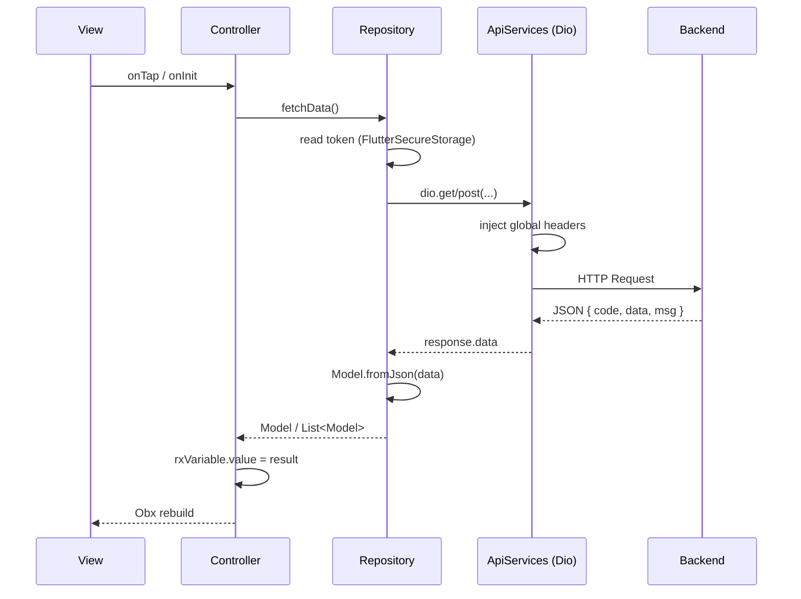

# API Guidelines

Dokumen ini mendeskripsikan arsitektur API **aktual** di proyek **new_evmoto_driver**, diinfer dari kode sumber. Bukan panduan generik.

> **Catatan struktur:** Folder yang disebutkan dalam scope analisis (`lib/core/network`, `lib/core/api`, `lib/shared/network`, `lib/features/**/data|repository|datasource|remote`) **tidak ada** di proyek ini. Implementasi API berada di `lib/app/services/api_services.dart`, `lib/app/repositories/`, dan `lib/app/data/models/`.

---

## Overview

### Arsitektur API

Proyek memakai **GetX Feature-First Modular Architecture** dengan **Repository Pattern** sederhana. Bukan Clean Architecture penuh — tidak ada layer `domain/`, `entity/`, `usecase/`, atau interface repository.

### Network Stack

| Komponen | Teknologi |
|---|---|
| HTTP client | [Dio](https://pub.dev/packages/dio) `^5.9.0` |
| Logging | `dio_curl_logger` (`CurlLoggingInterceptor`) |
| Token storage | `flutter_secure_storage` |
| Env secrets | `flutter_dotenv` (`.env`, mis. `GOOGLE_KEY`) |
| Base URL | Konstanta di `lib/environment.dart` |

**Tidak digunakan:** Retrofit, Chopper, `freezed`, `json_serializable`, `dio_smart_retry` (ada di komentar, tidak aktif).

### Request Flow

```
View (GetView / Widget)
    ↓ user action / onInit
Controller (GetxController)
    ↓ method call
Repository (lib/app/repositories/)
    ↓ Get.find<ApiServices>().dio
ApiServices (Dio + interceptors)
    ↓ HTTP
Backend REST API (baseUrl dari environment.dart)
```

**Alur alternatif via GetxService:**

```
Controller / SplashScreen
    ↓
UserServices (GetxService)
    ↓ UserRepository (diinstansiasi langsung di service)
REST API
```

**Real-time (bukan REST):** `SocketServices` (TCP), Firebase Firestore/Storage — di luar scope HTTP tetapi dipakai bersamaan dengan repository.



---

## API Client Configuration

### Base URL Strategy

Base URL didefinisikan sebagai **konstanta compile-time** di `lib/environment.dart`. Environment dipilih dengan mengomentari/mengaktifkan blok konstanta (bukan flavor build atau Remote Config).

```dart
// lib/environment.dart (Development v2 — aktif saat analisis)
const String baseUrl = 'http://8.215.203.97:8500';
const String socketUrl = '8.215.203.97';
const String prefixSendbirdUser = "dev_user_v2";
const String prefixSendbirdDriver = "dev_driver_v2";
const String env = "dev";
```

Setiap repository membangun URL lengkap secara manual:

```dart
var url = "$baseUrl/orderServer/api/order/queryOrderList";
```

`FirebaseRemoteConfigServices` memiliki default `driver_base_url`, tetapi **tidak dipakai** untuk mengganti `baseUrl` di repository.

### Environment Handling

| Sumber | Penggunaan |
|---|---|
| `lib/environment.dart` | `baseUrl`, `socketUrl`, prefix Sendbird, label `env` |
| `.env` (dotenv) | API key eksternal, mis. `GOOGLE_KEY` untuk Google Maps |
| `FirebaseRemoteConfig` | Link store, WhatsApp CS — **bukan** base URL API |

`flutter_dotenv` dimuat di `main.dart`:

```dart
await dotenv.load(fileName: ".env");
```

### Timeout Configuration

Satu instance `Dio` global di `ApiServices`:

```dart
final Dio dio = Dio(
  BaseOptions(
    connectTimeout: Duration(seconds: 10),
    sendTimeout: Duration(seconds: 10),
    receiveTimeout: Duration(seconds: 15),
  ),
);
```

Tidak ada `baseUrl` di `BaseOptions` — URL selalu absolute per request.

### Interceptors

**1. Curl Logging** (`dio_curl_logger`):

```dart
dio.interceptors.add(
  CurlLoggingInterceptor(showRequestLog: false, showResponseLog: false),
);
```

**2. Global Request Headers** (`InterceptorsWrapper.onRequest`):

| Header | Nilai |
|---|---|
| `version` | App version (`package_info_plus`) |
| `deviceid` | UUID persisten di Secure Storage (`device_id`) |
| `timestamp` | `DateTime.now().millisecondsSinceEpoch` |
| `from` | `"android"` / `"ios"` / `"others"` |
| `role` | `"driver"` |
| `nonce` | MD5 dari timestamp |

```dart
options.headers['version'] = packageVersion.value;
options.headers['deviceid'] = deviceId.value;
options.headers['timestamp'] = DateTime.now().millisecondsSinceEpoch.toString();
options.headers['from'] = Platform.isAndroid ? "android" : Platform.isIOS ? "ios" : "others";
options.headers['role'] = "driver";
options.headers['nonce'] = generateMd5Timestamp();
```

**3. Session Expired Handler** (`InterceptorsWrapper.onResponse`):

Jika `response.data['code'] == 600` (kecuali path `/notification/unsubscribe`), aplikasi melakukan force logout: clear storage, stop background service, tutup socket, redirect ke login.

**Tidak aktif (dikomentari):** proxy debug, `RetryInterceptor` (`dio_smart_retry`), global `onError` interceptor untuk pesan koneksi.

### Logging

- **Aktif:** `CurlLoggingInterceptor` (request/response log dimatikan via flag).
- **Tidak ada** structured API logger atau Crashlytics khusus per endpoint.

### Registrasi Service

`ApiServices` diregister permanen di `main.dart`:

```dart
Get.put(ApiServices(), permanent: true);
```

Semua repository mengakses via `Get.find<ApiServices>()`.

---

## Endpoint Definition Convention

### Cara Deklarasi Endpoint

Endpoint **tidak** dideklarasikan di file terpusat (tidak ada API interface/Retrofit). Setiap method repository:

1. Membangun `url` string dari `$baseUrl/...`
2. Memilih HTTP method (`get` / `post`)
3. Menyusun body (`FormData`, JSON map) atau `queryParameters`
4. Menyusun `Options(headers: ...)`
5. Memanggil `apiServices.dio`

### Naming Conventions

Backend memakai path berbasis **microservice prefix**:

| Prefix | Domain contoh |
|---|---|
| `account/` | Login, OTP, registrasi, notifikasi |
| `driver/` | Profil driver, bank, withdrawal |
| `orderServer/` | Order, working status |
| `businessProcess/` | Grab order, geocoding, OSRM routing |
| `payment/` | Deposit, recharge, revenue |
| `activity/` | Aktivitas driver |
| `app/` | Versioning, agreement, voice |
| `evaluation/` | Feedback, rating |
| `cancelOrder/` | Pembatalan order |

Pola path umum:

- `.../base/...` — endpoint publik / tanpa auth berat
- `.../api/...` — endpoint autentikasi dengan Bearer token

Contoh nyata:

```dart
// Login (tanpa Bearer)
"$baseUrl/account/base/driver/driverLogin"

// Order list (dengan Bearer)
"$baseUrl/orderServer/api/order/queryOrderList"

// Geocoding (GET + query params)
"$baseUrl/businessProcess/api/geocoding/reverse"
```

### Path Parameters

Jarang dipakai. Contoh yang ada:

```dart
// Payment status by orderId
var url = "$baseUrl/payment/recharge/status/query/$orderId";

// OSRM routing — koordinat di path
var url = "$baseUrl/businessProcess/api/osrm/route/v1/driving/"
    "$originLongitude,$originLatitude;$destinationLongitude,$destinationLatitude";
```

### Query Parameters

Dipakai terutama untuk **GET** dan API eksternal:

```dart
// Geocoding internal
queryParameters: {"lat": latitude, "lng": longitude}

// Google Maps (URL absolut, bukan baseUrl)
queryParameters: {
  "query": query,
  "language": language,
  "key": dotenv.get("GOOGLE_KEY"),
}

// OSRM
queryParameters: {"overview": "full", "geometries": "geojson"}
```

### HTTP Method & Body Convention

| Pola | Penggunaan |
|---|---|
| `POST` + `FormData.fromMap(...)` | **Dominan** — mayoritas endpoint backend |
| `POST` + JSON `{"phone": phone}` | Beberapa endpoint publik (`checkPhone`) |
| `GET` + Bearer header | `pendingDispatch`, `workingArea`, geocoding reverse |
| `GET` + query params | Google Maps, OSRM, geocoding places |

`Content-Type` header bervariasi per endpoint:

- `"multipart/form-data"` — paling umum untuk POST autentikasi
- `"application/json"` — beberapa GET/POST
- `"x-www-form-urlencoded"` — `queryOrderUserName`

---

## Request Models

### Folder Structure

```
lib/app/data/models/     # 49 file model
```

Tidak ada folder terpisah untuk request DTO. Request dikirim sebagai:

- `FormData.fromMap({ "key": value })` inline di repository, atau
- Map JSON literal (`data: {"phone": phone}`)

### Naming Rules

- File: `snake_case` + suffix `_model.dart` (mis. `user_info_model.dart`)
- Class: `PascalCase` tanpa suffix `Request` (mis. `UserInfo`, `Order`)
- Tidak ada konvensi `*Request` / `*Params` class

### Serialization Approach

**Manual** — tidak ada code generation.

- Tidak ada `freezed`
- Tidak ada `json_serializable` / `@JsonSerializable`
- Tidak ada `toJson()` terpisah untuk request; field dikirim langsung di `FormData.fromMap`

Contoh request di repository:

```dart
var formData = FormData.fromMap({
  "phone": phone,
  "password": password,
  "language": language,
});
var response = await dio.post(url, data: formData);
```

### Freezed / JsonSerializable

**Tidak dipakai** di proyek ini.

---

## Response Models

### Response Structure (Envelope Backend)

Mayoritas endpoint backend mengembalikan JSON envelope:

```json
{
  "code": 200,
  "msg": "success message or error",
  "data": { ... } | [ ... ] | null
}
```

Konvensi penanganan di repository:

```dart
if (response.data['code'] != 200) {
  throw response.data['msg'];
}
return UserInfo.fromJson(response.data['data']);
```

**Variasi:** Beberapa endpoint tidak selalu memeriksa `code` (mis. `getOrderPendingDispatch`, `getWorking`). Beberapa memeriksa dengan kondisi lebih longgar:

```dart
if (response.data['code'] != null && response.data['code'] != 200) {
  if (response.data['msg'] != null) {
    throw response.data['msg'];
  }
}
```

**Pengecualian envelope:**

- `uploadImage` — mengembalikan `response.data["url"]` langsung (tanpa `code`/`data`)
- Google Maps API — format response Google (`results`, `routes`)
- OSRM — JSON langsung di-parse ke `OpenMapDirection`

### DTO Conventions

Model di `lib/app/data/models/` berfungsi sebagai **DTO sekaligus model UI/domain**. Tidak ada pemisahan `*Response` → `*Entity`.

Pola class model:

```dart
class UserInfo {
  int? id;
  String? name;
  // ... nullable fields

  UserInfo({ this.id, this.name, ... });

  UserInfo.fromJson(Map<String, dynamic> json) {
    id = json['id'];
    name = json['name'];
    // manual assignment
  }

  Map<String, dynamic> toJson() {
    final Map<String, dynamic> data = {};
    data['id'] = id;
    // ...
    return data;
  }
}
```

### Mapping Strategy

| Langkah | Lokasi | Contoh |
|---|---|---|
| Parse JSON → Model | Repository | `UserInfo.fromJson(response.data['data'])` |
| Parse list | Repository (loop) | `for (var item in response.data['data']) { list.add(Order.fromJson(item)); }` |
| Enrichment | Repository | `OrderRepository.getOrderList` memanggil `getOrderUserDetail` per item |
| Assign ke state | Controller / Service | `userInfo.value = await userRepository.getUserInfoDetail(...)` |

**Tidak ada** mapper class terpisah. Model langsung dikonsumsi UI via GetX `.obs`.

---

## Repository Pattern

### Repository Responsibilities

Setiap file di `lib/app/repositories/` (25 repository) bertanggung jawab untuk:

1. Membangun URL endpoint
2. Membaca token dari `FlutterSecureStorage` (jika diperlukan)
3. Menyusun headers dan body request
4. Memanggil `apiServices.dio`
5. Memvalidasi `response.data['code']`
6. Parse `response.data['data']` ke model
7. Melempar error sebagai `String` (`throw response.data['msg']` atau `throw e.message.toString()`)

### Data Source Responsibilities

**Tidak ada** layer Remote Data Source terpisah. Repository = data source.

### Mapping Responsibilities

Mapping JSON → Model dilakukan **di dalam repository**, bukan di controller.

### Dependency Injection

| Mekanisme | Pola |
|---|---|
| Controller → Repository | Constructor injection via `Bindings` |
| Repository → ApiServices | `Get.find<ApiServices>()` |
| UserServices → UserRepository | `UserRepository()` diinstansiasi langsung di service |

Contoh binding:

```dart
// lib/app/modules/home/bindings/home_binding.dart
Get.lazyPut<HomeController>(
  () => HomeController(
    orderRepository: OrderRepository(),
    userRepository: UserRepository(),
    // ...
  ),
);
```

Contoh repository:

```dart
class UserRepository {
  final apiServices = Get.find<ApiServices>();
  final firebaseRemoteConfigServices = Get.find<FirebaseRemoteConfigServices>();

  Future<UserInfo> getUserInfoDetail({required int language}) async {
    // ... build url, headers, formData
    var response = await dio.post(url, data: formData, options: Options(headers: headers));
    if (response.data['code'] != 200) {
      throw response.data['msg'];
    }
    return UserInfo.fromJson(response.data['data']);
  }
}
```

### Repository yang Memanggil Repository Lain

`OrderRepository.getOrderList` melakukan N+1 fetch — setelah parse list order, memanggil `getOrderUserDetail` untuk setiap item sebelum return.

---

## Error Handling

### Pola Dominan

Tidak ada `Failure` class, `Either`, `Result<T>`, atau custom `ApiException`. Error ditangani dengan **`throw` primitive** (`String` atau `DioException`).

**Di Repository:**

```dart
// Business error dari backend
if (response.data['code'] != 200) {
  throw response.data['msg'];
}

// Network error — dua variasi:
} on DioException catch (e) {
  throw e.message.toString();   // dominan
}

} on DioException {
  rethrow;                       // geocoding, notification, versioning
}
```

**Di Controller:**

```dart
try {
  await repository.someMethod();
} catch (e) {
  SnackbarHelper.showSnackbarError(text: e.toString());
}

// atau tangkap DioException secara terpisah:
} on DioException catch (e) {
  SnackbarHelper.showSnackbarError(text: e.error.toString());
} catch (e) {
  SnackbarHelper.showSnackbarError(text: e.toString());
}
```

### DioException Handling

- **Global:** Tidak ada interceptor `onError` aktif (hanya dikomentari).
- **Session expired:** Ditangani di `onResponse` interceptor saat `code == 600`, bukan di `DioException`.
- **Connectivity:** `error_helper.dart` menyediakan dialog `showNoConnectivityInternetDialog`, tetapi integrasi `RetryInterceptor` dikomentari di `ApiServices`.

### Custom Exception / Failure Classes

**Tidak ada** di codebase.

### Result Wrappers

**Tidak ada.** Method repository mengembalikan tipe langsung (`Future<UserInfo>`, `Future<List<Order>>`, `Future<void>`) dan melempar exception pada kegagalan.

---

## Authentication

### Token Storage

| Key | Storage | Kapan ditulis |
|---|---|---|
| `token` | `FlutterSecureStorage` | Setelah login OTP/password berhasil |
| `device_id` | `FlutterSecureStorage` | Pertama kali app init (`ApiServices.getDeviceId`) |

Contoh penyimpanan token:

```dart
var token = await loginRepository.loginByMobileNumberOtp(...);
var storage = FlutterSecureStorage();
await storage.write(key: "token", value: token);
```

### Token Refresh Flow

**Tidak ada** mekanisme refresh token di proyek ini. Token disimpan sekali saat login dan dipakai sampai expired atau `code: 600`.

### Authorization Headers

Endpoint autentikasi membaca token per-request di repository:

```dart
var storage = FlutterSecureStorage();
var token = await storage.read(key: 'token');

var headers = {
  "Content-Type": "multipart/form-data",
  'Authorization': "Bearer $token",
};
```

Endpoint publik (login, OTP, registrasi, upload gambar dasar) **tidak** mengirim Bearer token.

### Session Handling

| Skenario | Perilaku |
|---|---|
| Splash screen | Cek `token` → `HOME` atau `LOGIN` |
| `code: 600` di response | Force logout global via interceptor |
| Logout manual | Clear storage, unsubscribe FCM, stop services |
| First run | `storage.deleteAll()` di splash |

---

## Pagination

### Strategi

**Offset/page-number pagination** dengan parameter `pageNum` dan `size`. Controller mengelola state halaman via `.obs` dan UI memakai `pull_to_refresh_flutter3` atau tombol "see more".

### Request Format

```dart
var formData = FormData.fromMap({
  "language": language,
  "size": size,
  "pageNum": pageNum,
  "state": state,        // opsional, untuk filter order
});
```

### Response Format

Backend mengembalikan **array di `data`** tanpa metadata `totalPages` / `hasMore` di envelope. Aplikasi menganggap tidak ada halaman berikutnya jika array kosong:

```dart
var activityList = await activityRepository.getActivityList(
  pageNum: pageNum.value,
  size: size.value,
);
this.activityList.addAll(activityList);
if (activityList.isEmpty) {
  isSeeMoreActivityList.value = false;
}
```

### Endpoint dengan Pagination

| Repository | Method |
|---|---|
| `OrderRepository` | `getOrderList`, `getHistoryOrderListV2`, `getHistoryOrderList` |
| `ActivityRepository` | `getActivityList` |
| `NotificationRepository` | `getNotificationList` |
| `HistoryBalanceRepository` | `getHistoryWithdrawList`, `getHistoryRevenueList`, `getHistoryRechargeList` |
| `AccountRepository` | `getServiceOrderList`, `getRatingAndReviewList` |
| `BankAccountRepository` | `getBankAccountList` |
| `WithdrawRepository` | `getWithdrawalHistoryList`, `getBankAccountList` |

---

## File Upload

### Multipart Handling (Backend API)

`UploadImageRepository.uploadImage` mengirim file via Dio `MultipartFile`:

```dart
var url = "$baseUrl/account/base/driver/img/upload";

var formData = FormData.fromMap({
  "file": await MultipartFile.fromFile(file.path, filename: file.name),
});

var response = await dio.post(url, data: formData);
return response.data["url"];
```

Endpoint ini **tanpa** Bearer token. Response langsung berisi `url`, bukan envelope `code`/`data`.

### Upload ke Firebase Storage

`UploadImageRepository.uploadCall` mengunggah ke Firebase Storage (bukan REST backend):

```dart
final storageRef = FirebaseStorage.instance.ref().child('evmoto_calls/$fileName');
await storageRef.putFile(file);
return await storageRef.getDownloadURL();
```

### UI Helper

`lib/app/utils/image_upload_helper.dart` — bottom sheet pemilihan kamera/galeri (`ImagePicker`). Upload aktual dilakukan di controller via `UploadImageRepository`.

---

## API Coding Standards

Aturan berikut **didukung oleh implementasi saat ini**:

1. **Semua panggilan HTTP backend harus melalui `ApiServices.dio`** — jangan buat instance `Dio()` baru di controller atau view.
2. **Controller tidak memanggil Dio langsung** — gunakan repository (atau GetxService yang membungkus repository).
3. **Repository di-inject ke controller via constructor** di `Bindings`, bukan diinstansiasi di dalam method controller (kecuali pola yang sudah ada di `UserServices`).
4. **Gunakan model di `lib/app/data/models/`** untuk parse response dengan `fromJson`.
5. **Bangun URL dari `$baseUrl/...`** dengan import `environment.dart`; jangan hardcode host di banyak tempat.
6. **Periksa `response.data['code'] != 200`** sebelum parse `data` — kecuali endpoint yang memang tidak memakai envelope (upload image, API eksternal).
7. **Lempar `response.data['msg']`** untuk error bisnis agar controller bisa menampilkan pesan ke user.
8. **Baca token dari `FlutterSecureStorage` key `'token'`** di repository untuk endpoint autentikasi.
9. **Gunakan `Authorization: Bearer $token`** untuk endpoint `/api/` yang memerlukan login.
10. **Kirim `language`** (dari `LanguageServices.languageCodeSystem`) di body request yang memerlukan i18n backend.
11. **Global headers** (`version`, `deviceid`, `role`, dll.) otomatis ditambahkan interceptor — jangan duplikasi manual kecuali ada kebutuhan khusus.
12. **Tangkap error di controller** dan tampilkan via `SnackbarHelper.showSnackbarError`.
13. **Pagination:** kirim `pageNum` + `size`; reset `pageNum` saat refresh; increment saat load more.
14. **File upload:** gunakan `FormData` + `MultipartFile.fromFile`; field name `"file"` untuk endpoint driver image upload.

---

## Current Inconsistencies

| Area | Inkonsistensi | Contoh |
|---|---|---|
| Validasi `code` | Tidak semua method memeriksa `code != 200` | `getOrderPendingDispatch`, `getWorking` vs `getUserInfoDetail` |
| DioException handling | `throw e.message` vs `rethrow` | `UserRepository` vs `GeocodingRepository` |
| Content-Type | `multipart/form-data`, `application/json`, `x-www-form-urlencoded` dipakai campur untuk POST serupa | `OrderRepository.getOrderUserDetail` |
| `firebaseRemoteConfigServices` | Di-inject di hampir semua repository tetapi **tidak pernah dipakai** | Semua `final firebaseRemoteConfigServices = Get.find<...>()` |
| Repository instantiation | Mayoritas via Binding; `UserServices` buat `UserRepository()` sendiri | `user_services.dart` |
| Response envelope | Mayoritas `{code,data,msg}`; upload image pakai `{url}` langsung | `upload_image_repository.dart` |
| External API | Google Maps pakai `apiServices.dio` yang sama dengan backend (termasuk interceptor header driver) | `google_maps_repository.dart` |
| Error di controller | `e.toString()` vs `e.error.toString()` vs `e.message` | `home_controller` vs `splash_screen_controller` |
| N+1 API calls | `getOrderList` fetch user detail per order dalam loop | `order_repository.dart` |
| Environment | `baseUrl` hardcoded di `environment.dart`; Remote Config `driver_base_url` tidak terhubung | `environment.dart` vs `firebase_remote_config_services.dart` |
| Retry / offline | `dio_smart_retry` dan global error interceptor dikomentari | `api_services.dart` |

**Tidak ditemukan:** Controller yang memanggil `apiServices.dio` langsung (pola dominan tetap Controller → Repository).

---

## Recommended Improvements

Rekomendasi berikut **mempertahankan arsitektur GetX + Repository** yang ada:

1. **Centralize response handling** — ekstrak helper `parseApiResponse(response)` untuk cek `code`, throw `msg`, return `data` secara konsisten.
2. **Hapus atau gunakan `firebaseRemoteConfigServices`** di repository — saat ini dead code; jika dipakai, pertimbangkan override `baseUrl` dari Remote Config.
3. **Standarkan error type** — buat `ApiException` dengan `message` dan optional `code` agar controller tidak bergantung pada `e.toString()` yang tidak konsisten.
4. **Aktifkan atau hapus `dio_smart_retry`** — koneksi tidak stabil driver app; `showNoConnectivityInternetDialog` sudah ada di `error_helper.dart`.
5. **Pisahkan Dio untuk API eksternal** — instance kedua tanpa header `role: driver` untuk Google Maps, atau gunakan `Dio()` lokal di `GoogleMapsRepository`.
6. **Kurangi duplikasi auth boilerplate** — helper `authorizedPost(url, formData)` yang membaca token dan menyusun headers.
7. **Dokumentasikan endpoint** — meski tidak pakai Retrofit, satu file `api_endpoints.dart` dengan konstanta path akan mengurangi typo (mis. `registeredDriver_` dengan underscore).
8. **Perbaiki N+1 di `getOrderList`** — minta backend menyertakan `orderUser` di response list, atau batch endpoint.
9. **Environment via build flavor** — ganti komentar manual di `environment.dart` dengan `--dart-define` atau flavor untuk prod/dev.
10. **Pertimbangkan `json_serializable`** untuk model baru — mengurangi risiko typo field manual di 49 model existing (migrate bertahap).

---

## Quick Reference

### Lokasi File Penting

| File | Fungsi |
|---|---|
| `lib/app/services/api_services.dart` | Dio singleton, interceptors |
| `lib/environment.dart` | `baseUrl`, `env` |
| `lib/app/repositories/*.dart` | 25 repository REST |
| `lib/app/data/models/*.dart` | 49 model JSON |
| `lib/app/modules/*/bindings/*.dart` | DI repository → controller |
| `lib/app/utils/snackbar_helper.dart` | Tampilan error ke user |
| `lib/app/utils/error_helper.dart` | Dialog no internet (belum terintegrasi penuh) |

### Kode Response Backend

| Code | Makna (di app) |
|---|---|
| `200` | Sukses |
| `600` | Session invalid / login di perangkat lain → force logout |
| Lainnya | Error bisnis → `throw msg` |
