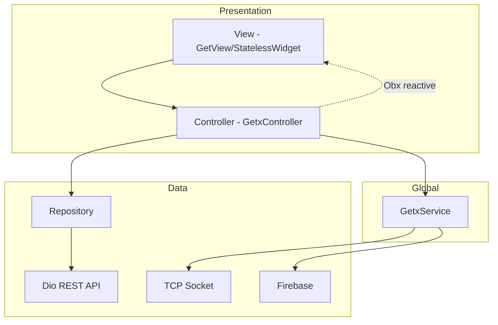
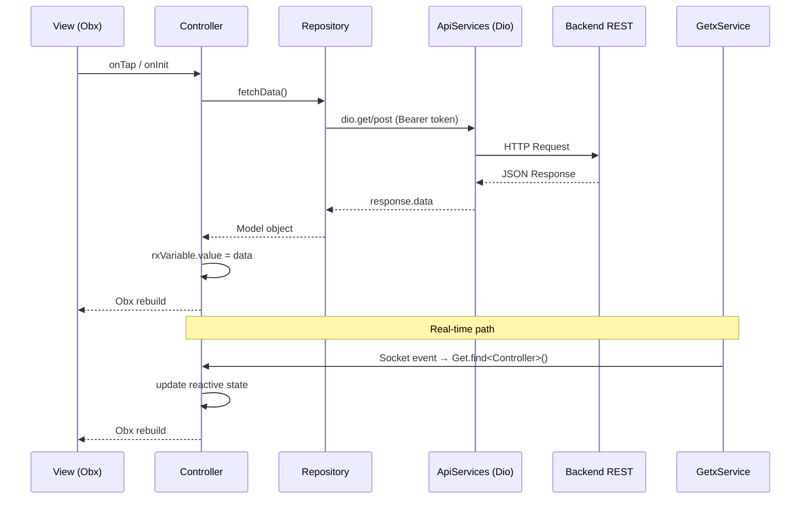
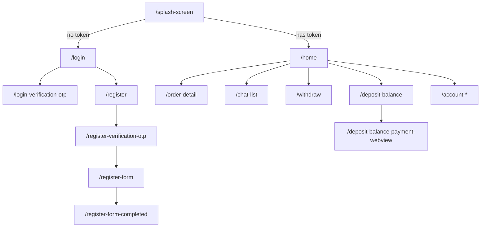

# Project Architecture

## Overview

**new_evmoto_driver** (Evmoto Driver) adalah aplikasi mobile resmi untuk pengemudi ojek listrik (ride-hailing). Aplikasi ini mendukung operasional harian driver: login/registrasi, menerima dan mengelola order, navigasi peta, chat dengan penumpang, pendapatan (guarantee income, coupon income), saldo deposit, penarikan dana, notifikasi real-time, serta pengaturan akun.

Arsitektur mengikuti pola **GetX Modular (Feature-First)** dengan pemisahan `View → Controller → Repository → API/Socket/Firebase`.

---

## Tech Stack

| Kategori                 | Teknologi                                               | Versi / Detail                                                              |
| ------------------------ | ------------------------------------------------------- | --------------------------------------------------------------------------- |
| **Flutter**              | Flutter SDK                                             | `>=3.35.0` (dari `pubspec.lock`; tidak ada pin eksplisit di `pubspec.yaml`) |
| **Dart**                 | Dart SDK                                                | `^3.9.2` (dari `pubspec.yaml`)                                              |
| **State Management**     | GetX                                                    | `^4.7.2`                                                                    |
| **Dependency Injection** | GetX (`Get.put`, `Get.lazyPut`, `Get.find`)             | Built-in GetX                                                               |
| **Routing**              | GetX (`GetMaterialApp`, `GetPage`, `Get.toNamed`, dll.) | Built-in GetX                                                               |
| **Networking**           | Dio                                                     | `^5.9.0`                                                                    |
| **Local Storage**        | `flutter_secure_storage`, `shared_preferences`          | Token di Secure Storage; preferensi umum di SharedPreferences               |
| **Testing Framework**    | `flutter_test`                                          | Hanya template default (`test/widget_test.dart`)                            |
| **Architecture Pattern** | Feature-First Modular + Repository Pattern              | Bukan Clean Architecture penuh (tidak ada layer UseCase/Entity terpisah)    |

### Dependensi Penting Lainnya

- **Firebase**: Core, Crashlytics, Remote Config, Messaging, Firestore, Storage
- **Maps & Lokasi**: `google_maps_flutter`, `geolocator`, `flutter_polyline_points`, `maps_toolkit`, `turf`
- **Real-time**: Raw TCP Socket (`dart:io Socket`) ke port 8888
- **Background**: `flutter_background_service`
- **Form**: `reactive_forms`
- **WebView**: `flutter_inappwebview` (pembayaran deposit)
- **Env**: `flutter_dotenv` (file `.env`)
- **CLI**: `get_cli` (generator route/module)

---

## Architecture Pattern

Proyek menggunakan kombinasi:

1. **Feature-First / Modular Architecture** — setiap fitur di `lib/app/modules/<feature>/` dengan subfolder `bindings/`, `controllers/`, `views/`.
2. **Repository Pattern** — akses data terpusat di `lib/app/repositories/`.
3. **Service Layer (GetxService)** — layanan global singleton di `lib/app/services/`.
4. **MVVM-like dengan GetX** — `View` (widget) + `Controller` (GetxController) + reactive state (`.obs`, `Obx`).

**Bukan** Clean Architecture penuh: tidak ada folder `domain/`, `usecase/`, atau interface repository. Repository langsung memanggil Dio/API.



---

## Folder Structure

Struktur aktual di repository (folder `core/` **tidak ada**):

```
lib/
├── main.dart                    # Entry point, inisialisasi Firebase & GetX services
├── environment.dart             # Konfigurasi baseUrl, socketUrl, env
└── app/
    ├── data/
    │   ├── consts/              # Konstanta bisnis (mis. OrderState)
    │   └── models/              # Data model / DTO (fromJson/toJson)
    ├── modules/                 # Feature modules (47 modul)
    │   └── <feature>/
    │       ├── bindings/        # Dependency injection per route
    │       ├── controllers/     # Business logic & state per fitur
    │       └── views/           # UI widgets (+ sub-views)
    ├── repositories/            # Data access layer (REST API via Dio)
    ├── routes/
    │   ├── app_pages.dart       # Definisi GetPage & daftar route
    │   └── app_routes.dart      # Konstanta path route (generated get_cli)
    ├── services/                # Global singleton services (GetxService)
    ├── utils/                   # Helper functions
    └── widgets/                 # Reusable widgets & dialog
```

### Fungsi Setiap Folder

| Folder                 | Fungsi                                                                       |
| ---------------------- | ---------------------------------------------------------------------------- |
| `lib/main.dart`        | Bootstrap app: Firebase, dotenv, registrasi service global, `GetMaterialApp` |
| `lib/environment.dart` | Konstanta URL API, socket, prefix Sendbird, environment (`dev`/`prod`)       |
| `app/data/models/`     | Model data dari API/Firebase (49 file model)                                 |
| `app/data/consts/`     | Konstanta domain, mis. `OrderState`                                          |
| `app/modules/`         | Fitur UI terisolasi per domain bisnis                                        |
| `app/repositories/`    | Abstraksi pemanggilan API; inject `ApiServices` via `Get.find`               |
| `app/routes/`          | Routing terpusat GetX                                                        |
| `app/services/`        | State & logic global (auth session, lokasi, socket, tema, bahasa)            |
| `app/utils/`           | Utilitas murni (snackbar, maps, socket, upload)                              |
| `app/widgets/`         | Komponen UI reusable                                                         |

---

## Dependency Flow

Alur dependency utama:

```
UI (View / GetView)
    ↓  user action / Obx rebuild
Controller (GetxController)
    ↓  method call
Repository
    ↓  Dio HTTP / Secure Storage
REST API (baseUrl dari environment.dart)

Controller
    ↓  Get.find
GetxService (global: UserServices, SocketServices, LocationServices, dll.)
    ↓
Socket / Firebase / Background Service / Geolocator
```

### Diagram Alur Data Lengkap



### Aturan DI

| Scope            | Mekanisme                                      | Contoh                                          |
| ---------------- | ---------------------------------------------- | ----------------------------------------------- |
| Global permanent | `Get.put(..., permanent: true)` di `main.dart` | `ApiServices`, `UserServices`, `SocketServices` |
| Per-route        | `Get.lazyPut` di `Bindings`                    | `HomeController`, `LoginController`             |
| Cross-controller | `Get.find<T>()`                                | Controller mengakses service global             |

Repository **tidak** diregister di GetX — diinstansiasi langsung di Binding dan di-inject ke Controller via constructor.

---

## GetX Usage

### Routing

- **`GetMaterialApp`** di `main.dart` dengan `initialRoute: AppPages.INITIAL` (`/splash-screen`).
- **`AppPages.routes`** berisi 47 `GetPage` di `app_pages.dart`.
- Navigasi: `Get.toNamed`, `Get.offNamed`, `Get.offAllNamed`, `Get.offAndToNamed`, `Get.back`.
- **`routingCallback`** di `main.dart`: refresh `HomeController` saat kembali ke route `HOME`.
- Konstanta route: class `Routes` dan `_Paths` di `app_routes.dart` (generated get_cli).

### Bindings

- Setiap route punya class `*Binding extends Bindings`.
- Pola dominan: `Get.lazyPut<Controller>(() => Controller(repository: XRepository()))`.
- **Pengecualian**: route `HOME` memakai `bindings: [HomeBinding(), AccountBinding()]` — dua controller sekaligus untuk tab navigasi bawah.

### Controllers

- **47 controller** fitur: `extends GetxController`.
- **1 controller lifecycle**: `AppLifecycleController extends GetxController` (di `app_lifecycle_services.dart`).
- View dominan: `extends GetView<Controller>` — akses via `controller` property.
- State reaktif: `.obs`, `Rx<T>`, `RxList`, `RxSet`.
- Lifecycle: `onInit`, `onReady`, `onClose` digunakan secara konsisten.

### Services (GetxService)

12 service global di `lib/app/services/`:

| Service                            | Tanggung Jawab                                               |
| ---------------------------------- | ------------------------------------------------------------ |
| `ApiServices`                      | Dio instance, interceptor (header, session expired code 600) |
| `UserServices`                     | Profil driver & working area (reactive)                      |
| `ThemeColorServices`               | Palet warna aplikasi (reactive)                              |
| `TypographyServices`               | Style teks (reactive)                                        |
| `LanguageServices`                 | i18n dari JSON asset, kode bahasa sistem                     |
| `FirebaseRemoteConfigServices`     | Remote config (URL, link store, WhatsApp CS)                 |
| `FirebasePushNotificationServices` | FCM + local notification                                     |
| `SocketServices`                   | TCP WebSocket-like ke server order                           |
| `LocationServices`                 | Geolocator stream, permission                                |
| `BackgroundServices`               | Foreground service tracking lokasi driver                    |
| `VoiceServices`                    | Daftar suara notifikasi order                                |
| `AppLifecycleController`           | Observer app foreground/background                           |

### Dependency Injection

```dart
// main.dart - global services
Get.put(ApiServices(), permanent: true);
Get.put(UserServices(), permanent: true);
// ...

// binding - per feature
Get.lazyPut<HomeController>(() => HomeController(
  vehicleRepository: VehicleRepository(),
  orderRepository: OrderRepository(),
  // ...
));
```

---

## Feature Modules

Total **47 modul fitur**. Tidak ada service khusus per modul — modul mengonsumsi `GetxService` global.

| Feature                                      | Controller                                        | Binding                                        | View                                        | Service (modul) |
| -------------------------------------------- | ------------------------------------------------- | ---------------------------------------------- | ------------------------------------------- | --------------- |
| splash_screen                                | SplashScreenController                            | SplashScreenBinding                            | SplashScreenView                            | Not Found       |
| login                                        | LoginController                                   | LoginBinding                                   | LoginView                                   | Not Found       |
| login_verification_otp                       | LoginVerificationOtpController                    | LoginVerificationOtpBinding                    | LoginVerificationOtpView                    | Not Found       |
| register                                     | RegisterController                                | RegisterBinding                                | RegisterView                                | Not Found       |
| register_verification_otp                    | RegisterVerificationOtpController                 | RegisterVerificationOtpBinding                 | RegisterVerificationOtpView                 | Not Found       |
| register_form                                | RegisterFormController                            | RegisterFormBinding                            | RegisterFormView                            | Not Found       |
| register_form_completed                      | RegisterFormCompletedController                   | RegisterFormCompletedBinding                   | RegisterFormCompletedView                   | Not Found       |
| terms_and_conditions                         | TermsAndConditionsController                      | TermsAndConditionsBinding                      | TermsAndConditionsView                      | Not Found       |
| privacy_policy                               | PrivacyPolicyController                           | PrivacyPolicyBinding                           | PrivacyPolicyView                           | Not Found       |
| home                                         | HomeController                                    | HomeBinding                                    | HomeView                                    | Not Found       |
| account                                      | AccountController                                 | AccountBinding                                 | AccountView                                 | Not Found       |
| order_detail                                 | OrderDetailController                             | OrderDetailBinding                             | OrderDetailView                             | Not Found       |
| order_payment_confirmation                   | OrderPaymentConfirmationController                | OrderPaymentConfirmationBinding                | OrderPaymentConfirmationView                | Not Found       |
| order_payment_detail                         | OrderPaymentDetailController                      | OrderPaymentDetailBinding                      | OrderPaymentDetailView                      | Not Found       |
| order_payment_pending                        | OrderPaymentPendingController                     | OrderPaymentPendingBinding                     | OrderPaymentPendingView                     | Not Found       |
| order_payment_pending_fee_detail             | OrderPaymentPendingFeeDetailController            | OrderPaymentPendingFeeDetailBinding            | OrderPaymentPendingFeeDetailView            | Not Found       |
| deposit_balance                              | DepositBalanceController                          | DepositBalanceBinding                          | DepositBalanceView                          | Not Found       |
| deposit_balance_payment_webview              | DepositBalancePaymentWebviewController            | DepositBalancePaymentWebviewBinding            | DepositBalancePaymentWebviewView            | Not Found       |
| withdraw                                     | WithdrawController                                | WithdrawBinding                                | WithdrawView                                | Not Found       |
| withdraw_amount                              | WithdrawAmountController                          | WithdrawAmountBinding                          | WithdrawAmountView                          | Not Found       |
| withdraw_detail                              | WithdrawDetailController                          | WithdrawDetailBinding                          | WithdrawDetailView                          | Not Found       |
| add_edit_withdraw_bank_account               | AddEditWithdrawBankAccountController              | AddEditWithdrawBankAccountBinding              | AddEditWithdrawBankAccountView              | Not Found       |
| history_balance_all                          | HistoryBalanceAllController                       | HistoryBalanceAllBinding                       | HistoryBalanceAllView                       | Not Found       |
| history_balance_revenue                      | HistoryBalanceRevenueController                   | HistoryBalanceRevenueBinding                   | HistoryBalanceRevenueView                   | Not Found       |
| history_balance_withdraw                     | HistoryBalanceWithdrawController                  | HistoryBalanceWithdrawBinding                  | HistoryBalanceWithdrawView                  | Not Found       |
| history_balance_recharge                     | HistoryBalanceRechargeController                  | HistoryBalanceRechargeBinding                  | HistoryBalanceRechargeView                  | Not Found       |
| history_guarantee_income                     | HistoryGuaranteeIncomeController                  | HistoryGuaranteeIncomeBinding                  | HistoryGuaranteeIncomeView                  | Not Found       |
| my_activity                                  | MyActivityController                              | MyActivityBinding                              | MyActivityView                              | Not Found       |
| my_order                                     | MyOrderController                                 | MyOrderBinding                                 | MyOrderView                                 | Not Found       |
| my_order_v2                                  | MyOrderV2Controller                               | MyOrderV2Binding                               | MyOrderV2View                               | Not Found       |
| notification                                 | NotificationController                            | NotificationBinding                            | NotificationView                            | Not Found       |
| chat_list                                    | ChatListController                                | ChatListBinding                                | ChatListView                                | Not Found       |
| chat_detail                                  | ChatDetailController                              | ChatDetailBinding                              | ChatDetailView                              | Not Found       |
| switch_vehicle                               | SwitchVehicleController                           | SwitchVehicleBinding                           | SwitchVehicleView                           | Not Found       |
| photo_viewer                                 | PhotoViewerController                             | PhotoViewerBinding                             | PhotoViewerView                             | Not Found       |
| agreement_guarantee_income                   | AgreementGuaranteeIncomeController                | AgreementGuaranteeIncomeBinding                | AgreementGuaranteeIncomeView                | Not Found       |
| agreement_coupon_income                      | AgreementCouponIncomeController                   | AgreementCouponIncomeBinding                   | AgreementCouponIncomeView                   | Not Found       |
| account_my_evaluation                        | AccountMyEvaluationController                     | AccountMyEvaluationBinding                     | AccountMyEvaluationView                     | Not Found       |
| account_feedback                             | AccountFeedbackController                         | AccountFeedbackBinding                         | AccountFeedbackView                         | Not Found       |
| account_service                              | AccountServiceController                          | AccountServiceBinding                          | AccountServiceView                          | Not Found       |
| account_update_mobile_phone                  | AccountUpdateMobilePhoneController                | AccountUpdateMobilePhoneBinding                | AccountUpdateMobilePhoneView                | Not Found       |
| account_update_mobile_phone_verification_otp | AccountUpdateMobilePhoneVerificationOtpController | AccountUpdateMobilePhoneVerificationOtpBinding | AccountUpdateMobilePhoneVerificationOtpView | Not Found       |
| account_other_setting                        | AccountOtherSettingController                     | AccountOtherSettingBinding                     | AccountOtherSettingView                     | Not Found       |
| account_language                             | AccountLanguageController                         | AccountLanguageBinding                         | AccountLanguageView                         | Not Found       |
| account_user_guide                           | AccountUserGuideController                        | AccountUserGuideBinding                        | AccountUserGuideView                        | Not Found       |
| account_legal_terms_and_platform_rules       | AccountLegalTermsAndPlatformRulesController       | AccountLegalTermsAndPlatformRulesBinding       | AccountLegalTermsAndPlatformRulesView       | Not Found       |
| account_about_us                             | AccountAboutUsController                          | AccountAboutUsBinding                          | AccountAboutUsView                          | Not Found       |

### Repositories (25 file)

`account_repository`, `activity_repository`, `advance_booking_repository`, `agreement_repository`, `bank_account_repository`, `forget_password_repository`, `geocoding_repository`, `google_maps_repository`, `guarantee_income_repository`, `history_balance_repository`, `login_repository`, `notification_repository`, `open_maps_repository`, `order_repository`, `otp_repository`, `payment_repository`, `query_image_repository`, `register_repository`, `system_image_repository`, `upload_image_repository`, `user_repository`, `vehicle_repository`, `versioning_server_repository`, `voice_repository`, `withdraw_repository`

---

## Data Flow

### Alur REST API (umum)

1. **View** memicu aksi user (tap, init).
2. **Controller** memanggil method repository.
3. **Repository** membaca token dari `FlutterSecureStorage`, membangun URL dari `environment.dart`, memanggil `Get.find<ApiServices>().dio`.
4. **ApiServices** menambahkan header (`version`, `deviceid`, `timestamp`, `from`, `role`, `nonce`).
5. Response JSON di-parse ke **Model** (`fromJson`).
6. Controller mengassign ke **Rx variable** (`model.value = ...`).
7. **Obx** di View rebuild otomatis.

### Alur Real-time (Socket)

1. `SocketServices` maintain koneksi TCP ke `socketUrl:8888`.
2. Event JSON diterima (`DRIVER_POSITION`, order status, dll.).
3. `SocketServices` memanggil `Get.find<HomeController>()` / `OrderDetailController` langsung.
4. Controller update state reaktif → UI rebuild.

### Alur Firebase

- **Firestore**: Chat order (`chat_detail`, `chat_list`, `order_detail`) — real-time stream.
- **FCM**: Push notification order via `FirebasePushNotificationServices`.
- **Remote Config**: URL dinamis & konfigurasi app.
- **Crashlytics**: Error reporting global di `main.dart`.
- **Storage**: Upload gambar via `upload_image_repository.dart`.

### Alur Autentikasi

1. Login → token disimpan `FlutterSecureStorage` key `token`.
2. Splash screen cek token → `HOME` atau `LOGIN`.
3. API return `code: 600` → force logout, clear storage, `Get.offAllNamed(LOGIN)`.

---

## Shared Components

### Reusable Widgets (`lib/app/widgets/`)

| Widget                                         | Fungsi                               |
| ---------------------------------------------- | ------------------------------------ |
| `loader_elevated_button_widget.dart`           | Tombol elevated dengan loading state |
| `loader_outlined_button_widget.dart`           | Tombol outlined dengan loading state |
| `loading_dialog.dart`                          | Dialog loading                       |
| `global_body_handler.dart`                     | Handler body global                  |
| `dashed_line.dart`                             | Garis putus-putus                    |
| `advance_booking_cancel_dialog_widget.dart`    | Dialog cancel advance booking        |
| `dialog/guarantee_income_area_in_dialog.dart`  | Dialog area guarantee income masuk   |
| `dialog/guarantee_income_area_out_dialog.dart` | Dialog area guarantee income keluar  |

### Utilities (`lib/app/utils/`)

| File                            | Fungsi                        |
| ------------------------------- | ----------------------------- |
| `common_helper.dart`            | Helper umum                   |
| `error_helper.dart`             | Penanganan error              |
| `general_helper.dart`           | Helper generik                |
| `snackbar_helper.dart`          | Snackbar error/success        |
| `google_maps_helper.dart`       | Helper Google Maps            |
| `bitmap_descriptor_helper.dart` | Custom map marker icon        |
| `location_helper.dart`          | Helper lokasi                 |
| `socket_helper.dart`            | Konversi bytes socket ke JSON |
| `image_upload_helper.dart`      | Upload gambar                 |
| `time_process_helper.dart`      | Helper waktu                  |

### Extensions

**Not Found** — tidak ada folder atau file `extension` khusus di `lib/`.

### Constants

| Lokasi                                       | Isi                                                        |
| -------------------------------------------- | ---------------------------------------------------------- |
| `lib/environment.dart`                       | `baseUrl`, `socketUrl`, `prefixSendbirdUser/Driver`, `env` |
| `lib/app/data/consts/order_state_const.dart` | `OrderState` (WAITING_LIST=1 … CANCEL_PENDING_PAYMENT=12)  |
| `Routes` / `_Paths`                          | Konstanta path navigasi                                    |

### Themes

Tidak memakai `ThemeData` lengkap terpusat. Styling via:

- **`ThemeColorServices`** — 40+ warna reaktif (`primaryBlue`, `backgroundColor`, dll.)
- **`TypographyServices`** — style teks reaktif
- **`ThemeData`** minimal di `main.dart` (hanya `textSelectionTheme`)
- Font: **Google Fonts** (via dependency `google_fonts`)

---

## State Management

### Obx

- **Pola dominan** untuk reactive UI — digunakan di hampir semua View dan sub-view.
- View membungkus widget dengan `Obx(() => ...)` dan membaca `controller.*.value`.
- Contoh: `HomeView`, `LoginView`, semua history/withdraw views.

### GetBuilder

**Not Found** — tidak ada penggunaan `GetBuilder` di codebase.

### Rx Variables

- Deklarasi: `final foo = "".obs`, `Rx<T?>`, `RxList`, `RxSet`.
- Update: `foo.value = newValue` atau `foo(newValue)`.
- Digunakan di semua Controller dan GetxService.

### Workers

| Worker       | Lokasi                         | Penggunaan                                                      |
| ------------ | ------------------------------ | --------------------------------------------------------------- |
| `ever()`     | `order_detail_controller.dart` | Listen perubahan `locationServices.currentLatitude` dan `state` |
| `once()`     | Not Found                      | —                                                               |
| `debounce()` | Not Found                      | —                                                               |
| `interval()` | Not Found                      | —                                                               |

---

## Navigation Structure

### Initial Route

`/splash-screen` → cek token → `/login` atau `/home`

### Shell Navigation (Home)

`HomeView` menggunakan **bottom tab** via `selectedIndex` (0 = Home/Dashboard, 1 = Account). `AccountView` di-embed langsung di tab, bukan route terpisah saat di home shell.

### Daftar Semua Route

| Route                                           | Page                                        | Binding                                        |
| ----------------------------------------------- | ------------------------------------------- | ---------------------------------------------- |
| `/home`                                         | HomeView                                    | HomeBinding + AccountBinding                   |
| `/splash-screen`                                | SplashScreenView                            | SplashScreenBinding                            |
| `/login`                                        | LoginView                                   | LoginBinding                                   |
| `/register`                                     | RegisterView                                | RegisterBinding                                |
| `/terms-and-conditions`                         | TermsAndConditionsView                      | TermsAndConditionsBinding                      |
| `/privacy-policy`                               | PrivacyPolicyView                           | PrivacyPolicyBinding                           |
| `/login-verification-otp`                       | LoginVerificationOtpView                    | LoginVerificationOtpBinding                    |
| `/register-verification-otp`                    | RegisterVerificationOtpView                 | RegisterVerificationOtpBinding                 |
| `/register-form`                                | RegisterFormView                            | RegisterFormBinding                            |
| `/register-form-completed`                      | RegisterFormCompletedView                   | RegisterFormCompletedBinding                   |
| `/order-detail`                                 | OrderDetailView                             | OrderDetailBinding                             |
| `/order-payment-confirmation`                   | OrderPaymentConfirmationView                | OrderPaymentConfirmationBinding                |
| `/order-payment-detail`                         | OrderPaymentDetailView                      | OrderPaymentDetailBinding                      |
| `/deposit-balance`                              | DepositBalanceView                          | DepositBalanceBinding                          |
| `/deposit-balance-payment-webview`              | DepositBalancePaymentWebviewView            | DepositBalancePaymentWebviewBinding            |
| `/account`                                      | AccountView                                 | AccountBinding                                 |
| `/account-my-evaluation`                        | AccountMyEvaluationView                     | AccountMyEvaluationBinding                     |
| `/account-feedback`                             | AccountFeedbackView                         | AccountFeedbackBinding                         |
| `/account-service`                              | AccountServiceView                          | AccountServiceBinding                          |
| `/account-update-mobile-phone`                  | AccountUpdateMobilePhoneView                | AccountUpdateMobilePhoneBinding                |
| `/account-update-mobile-phone-verification-otp` | AccountUpdateMobilePhoneVerificationOtpView | AccountUpdateMobilePhoneVerificationOtpBinding |
| `/account-other-setting`                        | AccountOtherSettingView                     | AccountOtherSettingBinding                     |
| `/account-language`                             | AccountLanguageView                         | AccountLanguageBinding                         |
| `/account-user-guide`                           | AccountUserGuideView                        | AccountUserGuideBinding                        |
| `/account-legal-terms-and-platform-rules`       | AccountLegalTermsAndPlatformRulesView       | AccountLegalTermsAndPlatformRulesBinding       |
| `/account-about-us`                             | AccountAboutUsView                          | AccountAboutUsBinding                          |
| `/switch-vehicle`                               | SwitchVehicleView                           | SwitchVehicleBinding                           |
| `/withdraw`                                     | WithdrawView                                | WithdrawBinding                                |
| `/add-edit-withdraw-bank-account`               | AddEditWithdrawBankAccountView              | AddEditWithdrawBankAccountBinding              |
| `/withdraw-amount`                              | WithdrawAmountView                          | WithdrawAmountBinding                          |
| `/withdraw-detail`                              | WithdrawDetailView                          | WithdrawDetailBinding                          |
| `/photo-viewer`                                 | PhotoViewerView                             | PhotoViewerBinding                             |
| `/history-balance-all`                          | HistoryBalanceAllView                       | HistoryBalanceAllBinding                       |
| `/history-balance-revenue`                      | HistoryBalanceRevenueView                   | HistoryBalanceRevenueBinding                   |
| `/history-balance-withdraw`                     | HistoryBalanceWithdrawView                  | HistoryBalanceWithdrawBinding                  |
| `/history-balance-recharge`                     | HistoryBalanceRechargeView                  | HistoryBalanceRechargeBinding                  |
| `/notification`                                 | NotificationView                            | NotificationBinding                            |
| `/order-payment-pending`                        | OrderPaymentPendingView                     | OrderPaymentPendingBinding                     |
| `/order-payment-pending-fee-detail`             | OrderPaymentPendingFeeDetailView            | OrderPaymentPendingFeeDetailBinding            |
| `/chat-list`                                    | ChatListView                                | ChatListBinding                                |
| `/my-activity`                                  | MyActivityView                              | MyActivityBinding                              |
| `/my-order`                                     | MyOrderView                                 | MyOrderBinding                                 |
| `/agreement-guarantee-income`                   | AgreementGuaranteeIncomeView                | AgreementGuaranteeIncomeBinding                |
| `/agreement-coupon-income`                      | AgreementCouponIncomeView                   | AgreementCouponIncomeBinding                   |
| `/chat-detail`                                  | ChatDetailView                              | ChatDetailBinding                              |
| `/history-guarantee-income`                     | HistoryGuaranteeIncomeView                  | HistoryGuaranteeIncomeBinding                  |
| `/my-order-v2`                                  | MyOrderV2View                               | MyOrderV2Binding                               |



---

## External Integrations

| Integrasi                    | Status              | Detail Implementasi                                                                                                       |
| ---------------------------- | ------------------- | ------------------------------------------------------------------------------------------------------------------------- |
| **REST API**                 | Ditemukan           | Dio ke `baseUrl` (`environment.dart`); path contoh: `/account/base/driver/`, `/orderServer/`, `/payment/`                 |
| **TCP Socket**               | Ditemukan           | `Socket.connect(socketUrl, 8888)` — order real-time, posisi driver                                                        |
| **Firebase Core**            | Ditemukan           | Inisialisasi di `main.dart`                                                                                               |
| **Firebase Crashlytics**     | Ditemukan           | Global error handler di `main.dart`                                                                                       |
| **Firebase Remote Config**   | Ditemukan           | `FirebaseRemoteConfigServices`                                                                                            |
| **Firebase Cloud Messaging** | Ditemukan           | `FirebasePushNotificationServices` + `flutter_local_notifications`                                                        |
| **Cloud Firestore**          | Ditemukan           | Chat order di `chat_detail`, `chat_list`, `home`, `order_detail`                                                          |
| **Firebase Storage**         | Ditemukan           | `upload_image_repository.dart`                                                                                            |
| **Google Maps**              | Ditemukan           | `google_maps_flutter`, `GoogleMapsRepository`, `google_maps_helper`                                                       |
| **Geolocator**               | Ditemukan           | `LocationServices`, background tracking                                                                                   |
| **Payment Gateway**          | Ditemukan (generik) | `PaymentRepository` + WebView redirect URL; tidak ada SDK payment spesifik (Midtrans/Xendit/Stripe)                       |
| **Sendbird**                 | Partial             | Prefix user di `environment.dart`; flag `isSendbirdInit` di `HomeController` — SDK Sendbird **Not Found** di dependencies |
| **Analytics**                | Not Found           | Tidak ada `firebase_analytics` atau tracking analytics                                                                    |
| **ffmpeg_kit**               | Ditemukan           | Dependency ada (`ffmpeg_kit_flutter_new`) — penggunaan spesifik perlu verifikasi per file                                 |

---

## Design Decisions

1. **GetX sebagai framework tunggal** — routing, DI, state management, dan service locator dalam satu paket.
2. **Repository tanpa interface** — class konkret langsung; constructor injection dari Binding.
3. **Service global permanent** — cross-cutting concern (API, user, socket, lokasi) hidup sepanjang app lifecycle.
4. **Reactive-first UI** — `Obx` + `.obs` sebagai satu-satunya mekanisme rebuild (tanpa `GetBuilder`/BLoC).
5. **Dual channel real-time** — TCP Socket untuk order + FCM untuk push notification.
6. **Token di Secure Storage** — `FlutterSecureStorage` key `token`; SharedPreferences untuk flag non-sensitif.
7. **i18n berbasis JSON asset** — `assets/jsons/driver_lang_*.json` dimuat oleh `LanguageServices`.
8. **Theming via reactive service** — bukan `ThemeData`/`ColorScheme` standar Material.
9. **get_cli code generation** — struktur route (`app_routes.dart`) dan konvensi penamaan module.
10. **Home sebagai shell** — bottom navigation in-view (`selectedIndex`), bukan nested `GetPage`.
11. **Session hijack handling** — interceptor Dio code `600` → logout paksa.
12. **Background location service** — tracking posisi driver saat online via `flutter_background_service`.
13. **Sub-view pattern** — view kompleks dipecah ke folder `views/<feature>_view/` (mis. `home_view/`).
14. **Environment hardcoded** — `environment.dart` berisi URL aktif (saat ini dev v2); bukan fully dari Remote Config.

---

## Improvement Opportunities

### Refactoring

- **`HomeController` terlalu besar** (~2800+ baris) — pecah ke use-case handler atau sub-controller.
- **`OrderDetailController` sangat besar** (~2200+ baris) — ekstrak logic maps, chat, socket ke service terpisah.
- **Duplikasi `my_order` dan `my_order_v2`** — konsolidasi atau dokumentasikan perbedaan dan rencana deprecate.
- **Repository tidak ter-register DI** — sulit di-mock untuk test; pertimbangkan `Get.lazyPut` atau interface.
- **`test/widget_test.dart` outdated** — masih template counter app, tidak kompatibel dengan `main.dart` aktual.

### Performance

- **`HomeView` sangat besar** (~2900+ baris) — risiko rebuild luas; pecah widget dan batasi scope `Obx`.
- **Socket reconnect setiap 3 detik** (`Timer.periodic`) — pertimbangkan backoff exponential.
- **Polling payment status 5 detik** di `DepositBalancePaymentWebviewController` — evaluasi webhook/push sebagai pengganti.

### Scalability

- **Tidak ada layer domain/usecase** — logic bisnis sulit di-share antar modul seiring pertumbuhan fitur.
- **Cross-controller `Get.find` langsung** dari `SocketServices` — coupling tinggi; pertimbangkan event bus atau stream terpusat.
- **Environment URL hardcoded** — migrasi penuh ke Firebase Remote Config atau flavor build.

### Maintainability

- Tambahkan **unit test** untuk Repository dan Controller kritis (order, payment, auth).
- Standarisasi **error handling** — saat ini mix throw string, `DioException`, dan snackbar langsung di controller.
- Dokumentasikan **perbedaan `my_order` vs `my_order_v2`** dan status Sendbird integration.
- Hapus atau aktifkan kode **commented-out** (retry interceptor, background FCM handler) untuk mengurangi kebingungan.

---

## Architecture Summary

1. Aplikasi driver ride-hailing motor listrik Evmoto berbasis **Flutter + GetX**.
2. Pola **Feature-First Modular** dengan 47 modul di `lib/app/modules/`.
3. **Repository Pattern** untuk akses REST API via **Dio** (`ApiServices`).
4. **12 GetxService global** diinisialisasi permanent di `main.dart`.
5. State UI **100% reaktif** via `.obs` dan `Obx` — tanpa `GetBuilder`.
6. Routing terpusat di `app_pages.dart` dengan **47 GetPage**.
7. Entry point `/splash-screen` → auth check → `/home` atau `/login`.
8. **Home shell** memakai bottom tab (`selectedIndex`) menggabungkan dashboard + account.
9. Real-time order via **TCP Socket port 8888** + **Firebase Cloud Messaging**.
10. Chat order memakai **Cloud Firestore** real-time stream.
11. Auth token di **FlutterSecureStorage**; logout paksa pada response code `600`.
12. Lokasi driver di-track via **Geolocator** + **background foreground service**.
13. Pembayaran deposit via **REST + InAppWebView** redirect URL.
14. Tema & i18n dikelola service reaktif, bukan Material Theme standar.
15. **25 repository** sebagai satu-satunya lapisan data (tanpa usecase/domain).
16. Maps & navigasi via **Google Maps** + helper polyline/direction.
17. Firebase: **Crashlytics, Remote Config, FCM, Firestore, Storage** — Analytics tidak ada.
18. Testing hampir **tidak ada** — hanya template default yang tidak valid.
19. Beberapa controller/view **monolitik** (home, order_detail) — area risiko maintainability utama.
20. Konfigurasi environment saat ini di `environment.dart` (dev v2: `8.215.203.97:8500`).
