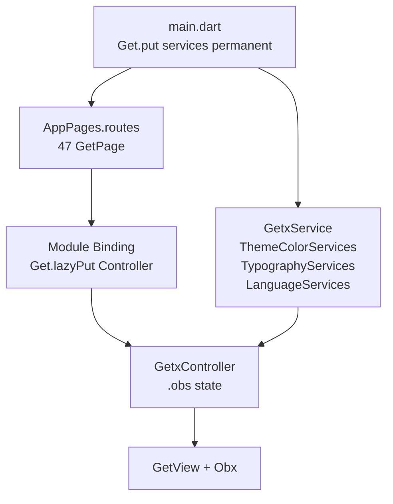

# UI Guidelines

Dokumen ini mendeskripsikan arsitektur UI **aktual** di proyek **new_evmoto_driver**, diinfer dari kode sumber. Bukan panduan generik Flutter atau GetX.

> **Catatan struktur:** Folder yang disebutkan dalam scope analisis (`lib/app/theme/`, `lib/app/design_system/`, `lib/app/common/`, `lib/app/global_widgets/`, `lib/app/shared/`, `lib/app/core/`) **tidak ada** di proyek ini. Styling terpusat di `lib/app/services/theme_color_services.dart` dan `lib/app/services/typography_services.dart`. Widget reusable berada di `lib/app/widgets/` dan `lib/app/utils/`.

---

## 1. Overview

### Arsitektur UI

Proyek memakai **GetX Feature-First Modular Architecture** dengan pola MVVM-like:

```
Route (GetPage)
    ↓
Binding (Get.lazyPut)
    ↓
Controller (GetxController + .obs)
    ↓
View (GetView + Obx)
    ↓
Sub-View / Shared Widget (opsional)
```

**Alur data UI:**



### Karakteristik utama

| Aspek | Implementasi aktual |
|---|---|
| Framework state | GetX (`get: ^4.x`) |
| Scaffolding route | **get_cli** (`app_routes.dart` — `DO NOT EDIT`) |
| View base class | `GetView<Controller>` (dominan) |
| Reactive UI | `Obx` + `.obs` — **tanpa** `GetBuilder` |
| Design tokens | `ThemeColorServices` + `TypographyServices` (bukan `ThemeData` lengkap) |
| Font | Google Fonts — **Nunito Sans** via `google_fonts` |
| Modul fitur | **47** modul, masing-masing `bindings/` + `controllers/` + `views/` |

### Hubungan dengan layer lain

- **Controller** memanggil **Repository** untuk data (bukan langsung dari View).
- **GetxService** global (`ThemeColorServices`, `LanguageServices`, dll.) di-resolve via `Get.find` di controller.
- View hanya membaca state controller dan memanggil method controller pada interaksi user.

---

## 2. UI Folder Structure

### Struktur aktual

```
lib/
└── app/
    ├── modules/              # 47 feature modules (UI per layar/fitur)
    │   └── <feature>/
    │       ├── bindings/
    │       ├── controllers/
    │       └── views/
    ├── routes/               # AppPages, Routes, _Paths (get_cli)
    ├── services/             # ThemeColorServices, TypographyServices, LanguageServices, ...
    ├── widgets/              # 8 reusable widget files
    ├── utils/                # SnackbarHelper, error_helper, common_helper, image_upload_helper
    ├── data/
    │   ├── models/
    │   └── consts/           # order_state_const.dart
    └── repositories/         # Data access (dipanggil dari controller)
```

### Folder yang **tidak ada**

| Path yang diharapkan | Status |
|---|---|
| `lib/app/theme/` | Tidak ada |
| `lib/app/design_system/` | Tidak ada |
| `lib/app/common/` | Tidak ada |
| `lib/app/global_widgets/` | Tidak ada |
| `lib/app/shared/` | Tidak ada |
| `lib/app/core/` | Tidak ada |
| Extension files khusus | Tidak ada |

### Tanggung jawab per folder

| Folder | Tanggung jawab UI |
|---|---|
| `modules/<feature>/views/` | Layar route, sub-view komposisional |
| `widgets/` | Widget reusable lintas fitur (button, dialog, loading wrapper) |
| `utils/` | Helper UI (snackbar, dialog koneksi, loading dialog, bottom sheet upload) |
| `services/theme_color_services.dart` | Palet warna reaktif |
| `services/typography_services.dart` | Skala tipografi reaktif |
| `services/language_services.dart` | String terjemahan untuk label UI |
| `routes/` | Registrasi `GetPage` dan konstanta path |

---

## 3. Module Structure

### Organisasi modul

**Semua 47 modul** mengikuti struktur identik:

```
lib/app/modules/<feature_name>/
├── bindings/
│   └── <feature_name>_binding.dart
├── controllers/
│   └── <feature_name>_controller.dart
└── views/
    ├── <feature_name>_view.dart              # modul sederhana (41 modul)
    └── <feature_name>_view/                  # modul komposit (6 modul)
        └── <feature_name>_<part>_sub_view.dart
```

Tidak ada modul dengan folder `widgets/`, `models/`, atau `services/` internal.

### Konvensi penamaan

| Layer | File (snake_case) | Class (PascalCase) |
|---|---|---|
| Binding | `login_binding.dart` | `LoginBinding extends Bindings` |
| Controller | `login_controller.dart` | `LoginController extends GetxController` |
| View (route) | `login_view.dart` | `LoginView extends GetView<LoginController>` |
| Sub-view | `home_balance_sub_view.dart` | `HomeBalanceSubView extends GetView<HomeController>` |

### Tier kompleksitas view

**Tier A — Modul sederhana (41 modul):** satu file `*_view.dart`.

Contoh: `login`, `splash_screen`, `deposit_balance`, `chat_detail`, `account_language`.

**Tier B — Modul komposit (6 modul):** parent view + sub-view di subfolder.

| Modul | File view | Sub-view |
|---|---|---|
| `home` | 6 | `home_balance_sub_view`, `order_card_home_sub_view`, `home_statistics_card_sub_view`, dll. |
| `my_order` | 7 | `my_order_all_sub_view`, `my_order_cancelled_sub_view`, `my_order_pending_payment_sub_view`, dll. |
| `my_activity` | 3 | `my_activity_coupon_income_sub_view`, `my_activity_guarantee_income_sub_view` |
| `notification` | 3 | `notification_card_sub_view`, `notification_not_found_sub_view` |
| `order_detail` | 2 | `order_detail_footer_sub_view` |
| `history_guarantee_income` | 5 | Nested 2 level: `history_guarantee_income_card_sub_view/history_guarantee_income_card_summary_sub_view` |

### Contoh trio modul (login)

**Binding** — `lib/app/modules/login/bindings/login_binding.dart`:

```dart
class LoginBinding extends Bindings {
  @override
  void dependencies() {
    Get.lazyPut<LoginController>(
      () => LoginController(loginRepository: LoginRepository()),
    );
  }
}
```

**Controller** — `lib/app/modules/login/controllers/login_controller.dart`:

```dart
class LoginController extends GetxController {
  final LoginRepository loginRepository;
  LoginController({required this.loginRepository});

  final themeColorServices = Get.find<ThemeColorServices>();
  final typographyServices = Get.find<TypographyServices>();
  final languageServices = Get.find<LanguageServices>();
  // ...
}
```

**View** — `lib/app/modules/login/views/login_view.dart`:

```dart
class LoginView extends GetView<LoginController> {
  const LoginView({super.key});
  @override
  Widget build(BuildContext context) {
    return Obx(() => Container(/* ... */));
  }
}
```

### Inventori modul per domain

| Domain | Modul |
|---|---|
| Auth / onboarding | `splash_screen`, `login`, `login_verification_otp`, `register`, `register_verification_otp`, `register_form`, `register_form_completed`, `terms_and_conditions`, `privacy_policy` |
| Core / home | `home`, `account`, `switch_vehicle`, `photo_viewer` |
| Orders | `order_detail`, `order_payment_confirmation`, `order_payment_detail`, `order_payment_pending`, `order_payment_pending_fee_detail`, `my_order`, `my_order_v2` |
| Balance / withdraw | `deposit_balance`, `deposit_balance_payment_webview`, `withdraw`, `withdraw_amount`, `withdraw_detail`, `add_edit_withdraw_bank_account`, `history_balance_all`, `history_balance_revenue`, `history_balance_withdraw`, `history_balance_recharge` |
| Activity / income | `my_activity`, `history_guarantee_income`, `agreement_guarantee_income`, `agreement_coupon_income` |
| Communication | `notification`, `chat_list`, `chat_detail` |
| Account settings | `account_my_evaluation`, `account_feedback`, `account_service`, `account_update_mobile_phone`, `account_update_mobile_phone_verification_otp`, `account_other_setting`, `account_language`, `account_user_guide`, `account_legal_terms_and_platform_rules`, `account_about_us` |

---

## 4. View Guidelines

### Pola dominan: `GetView<Controller>`

| Base class | Jumlah di `lib/app/modules/**/views/**` |
|---|---|
| `GetView<T>` | **64** file aktif |
| `StatelessWidget` | **0** |
| `StatefulWidget` | **0** |
| `GetWidget<T>` | **0** (seluruh `lib/`) |

**3 file stub kosong** (tanpa class widget):
- `my_order_card_in_service_sub_view.dart`
- `my_order_card_done_sub_view.dart`
- `my_order_card_cancelled_sub_view.dart`

### Pola view standar

```dart
class XxxView extends GetView<XxxController> {
  const XxxView({super.key});

  @override
  Widget build(BuildContext context) {
    return Obx(
      () => Scaffold(
        backgroundColor: controller.themeColorServices.backgroundColor.value,
        body: controller.isFetch.value
            ? Center(child: CircularProgressIndicator(
                color: controller.themeColorServices.primaryBlue.value))
            : /* konten */,
      ),
    );
  }
}
```

### Konvensi yang diamati

- Constructor hampir selalu **`const`** dengan `{super.key}`.
- Akses controller via property **`controller`** (bukan `Get.find` di view).
- Akses service via **`controller.themeColorServices`**, **`controller.typographyServices`**, **`controller.languageServices`**.
- **`Obx`** membungkus `build()` atau bagian yang reaktif.
- Sub-view **bukan route terpisah** — komponen komposisional yang share controller parent.

### Contoh sub-view dengan parameter

`lib/app/modules/notification/views/notification_view/notification_card_sub_view.dart`:

```dart
class NotificationCardSubView extends GetView<NotificationController> {
  final Notification notification;
  const NotificationCardSubView({super.key, required this.notification});
  // ...
}
```

### Contoh shell navigation (Home)

`HomeView` meng-embed `AccountView` sebagai tab bottom navigation via `selectedIndex`, bukan navigasi route terpisah saat di shell:

```dart
// lib/app/modules/home/views/home_view.dart
if (controller.selectedIndex.value == 0) ...[ /* dashboard */ ],
if (controller.selectedIndex.value == 1) ...[ const AccountView() ],
```

### Widget di luar modul

`lib/app/widgets/` memakai `StatelessWidget` (bukan `GetView`) karena tidak terikat satu controller modul:
- `GlobalBodyHandler`, `LoaderElevatedButton`, `DashedLine`, dll.

---

## 5. Controller Guidelines

### Tanggung jawab controller

| Tanggung jawab | Lokasi |
|---|---|
| State reaktif (`.obs`) | Controller |
| Fetch data via Repository | Controller (`onInit`, method async) |
| Navigasi (`Get.toNamed`, dialog) | Controller (dominan) atau View (beberapa `toNamed` di view) |
| Form validation & submit | Controller |
| Dispose resource | Controller (`onClose`) |
| Render widget tree | View saja |

### Lifecycle

| Method | Penggunaan aktual |
|---|---|
| `onInit()` | **46/46** modul — fetch awal, setup listener, `TabController` |
| `onReady()` | **47** override — sering hanya `super.onReady()` atau baca `Get.arguments` |
| `onClose()` | **47** override — dispose `TextEditingController`, cancel timer/stream |

**Contoh `onInit` dengan fetch:**

```dart
// lib/app/modules/home/controllers/home_controller.dart
@override
Future<void> onInit() async {
  super.onInit();
  isFetch.value = true;
  tabController ??= TabController(length: 3, vsync: this);
  await refreshAll();
  isFetch.value = false;
}
```

### Injeksi service di controller

Pola dominan — field final via `Get.find`:

```dart
final themeColorServices = Get.find<ThemeColorServices>();
final typographyServices = Get.find<TypographyServices>();
final languageServices = Get.find<LanguageServices>();
```

Repository di-inject via constructor dari Binding.

### Mixin tambahan

**5 controller** memakai `GetSingleTickerProviderStateMixin` untuk `TabController`:
- `home_controller`, `my_order_controller`, `my_order_v2_controller`, `my_activity_controller`, `notification_controller`

### Anti-pattern yang tidak ditemukan

- Controller tidak diinstansiasi langsung di View.
- Tidak ada business logic repository di View.

---

## 6. State Management Guidelines

### Pola dominan: `Obx` + `.obs`

| Pola | Status |
|---|---|
| `Obx` | **~67** penggunaan di views/widgets/controllers |
| `.obs` / `Rx<T>` / `RxList` | **~400+** deklarasi |
| `GetBuilder` | **0** — tidak digunakan |
| `update()` | Tidak dipakai (karena tidak ada `GetBuilder`) |

### Kapan memakai `Obx`

- Membungkus widget yang membaca nilai reaktif (`controller.foo.value`).
- Bisa di level `build()` penuh atau nested di dalam tree (contoh: `HomeView` punya beberapa `Obx` nested).

```dart
return Obx(
  () => Scaffold(
    body: controller.isFetch.value ? loadingWidget : contentWidget,
  ),
);
```

### Konvensi variabel reaktif

```dart
final isFetch = false.obs;           // loading halaman
final isCriticalError = false.obs;   // error fatal (splash, notification)
final isFormValid = false.obs;       // enable/disable tombol form
final userInfo = UserInfo().obs;     // model tunggal
final orderList = <Order>[].obs;     // list
```

### Workers — penggunaan minimal

Hanya di `order_detail_controller.dart`:

```dart
ever(locationServices.currentLatitude, (value) async {
  await handleSocketDriverPosition();
});

ever(state, (value) async {
  await measureTime("...", () => Future.wait([getOrderDetail(), getOrderUserDetail()]));
});
```

Tidak ada `debounce()`, `interval()`, atau `once()` di codebase.

### Pola loading tombol (lokal di widget)

`LoaderElevatedButton` punya `isLoading.obs` internal — tidak perlu state di controller:

```dart
// lib/app/widgets/loader_elevated_button_widget.dart
final isLoading = false.obs;
// onPressed: set true → await action → set false
```

---

## 7. Widget Composition Guidelines

### Hierarki komposisi

```
Route View (*_view.dart)
├── Scaffold / SafeArea / Stack
├── Sub-View (*_sub_view.dart)     # pecahan UI dalam modul yang sama
├── lib/app/widgets/*              # reusable lintas fitur
└── Inline widget (private)        # widget kecil sekali pakai di file yang sama
```

### Kapan membuat widget baru

| Tipe | Kapan | Lokasi | Contoh |
|---|---|---|---|
| **Route view** | Setiap layar dengan route `GetPage` | `modules/<feature>/views/<feature>_view.dart` | `LoginView` |
| **Sub-view** | UI kompleks dipecah, share controller parent | `modules/<feature>/views/<feature>_view/*_sub_view.dart` | `HomeBalanceSubView` |
| **Shared widget** | Dipakai ≥2 modul, tidak butuh controller spesifik | `lib/app/widgets/` | `LoaderElevatedButton` |
| **UI helper** | Snackbar, dialog, bottom sheet utility | `lib/app/utils/` | `SnackbarHelper`, `showLoadingDialog()` |
| **Empty state sub-view** | Empty state khusus satu modul | Di dalam folder views modul | `NotificationNotFoundSubView` |

### Keputusan berdasarkan implementasi aktual

- **Jangan** buat route baru untuk sub-view — sub-view di-compose di parent view.
- **Prioritaskan** `lib/app/widgets/` sebelum duplikasi button/dialog.
- Widget feature-specific yang hanya dipakai satu modul tetap di folder modul (contoh: `order_card_home_sub_view.dart`).
- `HomeView` sangat besar (~2900 baris) — pola sub-view sudah dipakai tapi file parent masih monolitik.

---

## 8. Design System

### Lokasi design tokens

| Token | File | Class |
|---|---|---|
| Warna | `lib/app/services/theme_color_services.dart` | `ThemeColorServices extends GetxService` |
| Tipografi | `lib/app/services/typography_services.dart` | `TypographyServices extends GetxService` |
| Spacing / radius / elevation | **Tidak terpusat** — nilai inline di views |

### Cara akses

```dart
// Di controller
final themeColorServices = Get.find<ThemeColorServices>();

// Di view (via controller)
controller.themeColorServices.primaryBlue.value
controller.typographyServices.bodyLargeBold.value.copyWith(color: ...)
```

Semua token warna dan tipografi adalah **`Rx<T>`** — dibungkus `.value` saat dipakai di widget.

### Nilai de facto (bukan file konstanta)

| Token | Nilai umum | Contoh penggunaan |
|---|---|---|
| Padding horizontal layar | `16` | `EdgeInsets.symmetric(horizontal: 16)` |
| Gap vertikal | `8`, `16`, `24`, `32` | `SizedBox(height: 16)` |
| Border radius card | `8` | Card kecil |
| Border radius button/dialog | `16` | `BorderRadius.circular(16)` |
| Border radius pill | `9999` | Tombol loading state |
| Tinggi tombol | `46` | `LoaderElevatedButton` |
| Spinner ukuran | `25×25` | `CircularProgressIndicator` wrapper |
| Elevation | `0` | Snackbar; shadow via `BoxShadow` |

### Shadow (de facto elevation)

```dart
boxShadow: [
  BoxShadow(
    color: controller.themeColorServices.overlayDark200.value.withValues(alpha: 0.10),
    blurRadius: 8,
    spreadRadius: 0,
    offset: Offset(0, 4),
  ),
],
```

---

## 9. Theme Guidelines

### `ThemeData` global — minimal

`lib/main.dart` hanya mengatur `textSelectionTheme`:

```dart
theme: ThemeData(
  textSelectionTheme: TextSelectionThemeData(
    cursorColor: Get.find<ThemeColorServices>().primaryBlue.value,
    selectionColor: Get.find<ThemeColorServices>().primaryBlue.value.withValues(alpha: 0.2),
    selectionHandleColor: Get.find<ThemeColorServices>().primaryBlue.value,
  ),
),
```

**Tidak diatur di `ThemeData` global:**
- `colorScheme`, `textTheme`, `appBarTheme`, `elevatedButtonTheme`, `darkTheme`

### System UI

```dart
SystemChrome.setSystemUIOverlayStyle(
  SystemUiOverlayStyle(
    statusBarColor: Colors.transparent,
    statusBarIconBrightness: Brightness.dark,
    systemNavigationBarColor: Colors.white,
    systemNavigationBarIconBrightness: Brightness.dark,
  ),
);
```

### Global builder

```dart
builder: (context, child) {
  return SafeArea(
    top: false, bottom: true, left: false, right: false,
    child: GestureDetector(
      onTap: () => FocusScope.of(context).unfocus(),
      child: child!,
    ),
  );
},
```

Tap di luar field akan unfocus keyboard di seluruh app.

### Theme override lokal

Date picker dan komponen Material tertentu dibungkus `Theme()` lokal di controller/view:

```dart
// lib/app/modules/my_activity/controllers/my_activity_controller.dart
return Theme(
  data: ThemeData.light().copyWith(
    colorScheme: ColorScheme.light(
      primary: themeColorServices.primaryBlue.value,
      onPrimary: Colors.white,
      surface: Colors.white,
      onSurface: Colors.black,
    ),
    datePickerTheme: DatePickerThemeData(backgroundColor: Colors.white, ...),
  ),
  child: Center(child: child),
);
```

### Tidak ada

- `ThemeExtension`
- Class `AppTheme` terpusat
- Dark mode

---

## 10. Color Guidelines

**Sumber:** `lib/app/services/theme_color_services.dart`

### Warna semantik

| Peran | Token | Hex |
|---|---|---|
| **Primary** | `primaryBlue` | `#0060C6` |
| **Background** | `backgroundColor` | `#F7F7F7` |
| **Surface putih** | `neutralsColorGrey0` | `#FFFFFF` |
| **Text primary** | `textColor` | `#272727` |
| **Text secondary** | `secondaryTextColor` | `#4D4D4D` |
| **Text tertiary** | `thirdTextColor`, `forthTextColor` | `#7D7D7D` |

### Success (hijau)

| Token | Hex |
|---|---|
| `sematicColorGreen100` | `#CAEDDB` |
| `sematicColorGreen200` | `#99CEB3` |
| `sematicColorGreen400` | `#63B871` |
| `sematicColorGreen500` | `#17412C` |

Snackbar success memakai warna inline di `snackbar_helper.dart`: bg `#E1FFE9`, text `#005216`.

### Warning (kuning)

| Token | Hex |
|---|---|
| `sematicColorYellow100` | `#FFEACC` |
| `sematicColorYellow300` | `#FFAD33` |
| `sematicColorYellow400` | `#FF9800` |
| `waitingToGoBackgroundColor` | `#FBE4A2` |

### Error (merah)

| Token | Hex |
|---|---|
| `sematicColorRed400` | `#F44336` |
| `sematicColorRed500` | `#A32A21` |
| `redColor` | `#E11C0B` |

Snackbar error: bg `#FFEBEB`, text `#CD0000` (inline di `snackbar_helper.dart`).

### Palet tambahan

- **Blue semantic:** `sematicColorBlue100`–`600`
- **Grey neutral:** `neutralsColorGrey100`–`900`
- **Slate:** `neutralsColorSlate100`–`800`
- **Overlay:** `overlayDark100`, `overlayDark200` (keduanya `#000000`)
- **Kontekstual:** `scheduleArrivalPlaceBackgroundColor` (`#D7EAFF`), `imageUploadMenuBackgroundColor`, dll.

### Secondary color

Tidak ada token `secondary` dedicated — hierarki teks memakai `secondaryTextColor` / `thirdTextColor`.

### Catatan penggunaan

Banyak view masih memakai **`Color(0XFF...)` inline** (gradient login, icon bottom sheet) di samping token service. Lihat [§24 Inconsistencies](#24-current-inconsistencies).

---

## 11. Typography Guidelines

**Sumber:** `lib/app/services/typography_services.dart`  
**Font:** Nunito Sans via `GoogleFonts.nunitoSans()` — tidak ada font custom di `pubspec.yaml`.

### Skala tipografi (bukan Flutter `TextTheme`)

| Token | Weight | Size | Line height | Peran |
|---|---|---|---|---|
| `headingLargeBold` | 700 | 32 | 1.2 | Display besar |
| `headingMediumBold` | 700 | 24 | 1.2 | Headline |
| `headingSmallBold` | 700 | 20 | 1.4 | Title / judul layar |
| `bodyLargeBold` | 700 | 16 | 1.4 | Body tebal |
| `bodyLargeRegular` | 400 | 16 | 1.4 | Body utama |
| `bodySmallRegular` | 400 | 14 | 1.2 | Body sekunder |
| `bodySmallBold` | 700 | 14 | 1.2 | Label tebal |
| `captionLargeBold` | 700 | 12 | 1.2 | Caption tebal |
| `captionLargeRegular` | 500 | 12 | 1.2 | Caption |
| `captionSmallBold` | 700 | 10 | 1.2 | Micro tebal |
| `captionSmallRegular` | 500 | 10 | 1.2 | Micro |

### Pola penggunaan

```dart
Text(
  controller.languageServices.language.value.loginTitle ?? "-",
  style: controller.typographyServices.headingSmallBold.value,
)

Text(
  "Label",
  style: controller.typographyServices.bodySmallRegular.value.copyWith(
    color: controller.themeColorServices.thirdTextColor.value,
  ),
)
```

Warna teks hampir selalu di-override via `.copyWith(color: ...)` — tidak embedded di token tipografi.

---

## 12. Layout Guidelines

### Screen padding

| Pola | Nilai | Contoh |
|---|---|---|
| Padding horizontal standar | `16` | `EdgeInsets.symmetric(horizontal: 16)` |
| Padding all (sheet/dialog) | `16` | Bottom sheet logout |
| AppBar default | Material default + custom `backgroundColor` dari service |

### Section spacing

Urutan vertikal umum: `SizedBox(height: 16)` → konten → `SizedBox(height: 8)` → subteks → `SizedBox(height: 24)` atau `32` sebelum CTA.

### Scrolling pattern

| Pola | Kapan |
|---|---|
| `SingleChildScrollView` | Form panjang (`login_view`, `register_form_view`) |
| `NestedScrollView` + slivers | `home_view` (header + tab content) |
| `SmartRefresher` + `SingleChildScrollView` | List dengan pull-to-refresh (`my_order_*_sub_view`) |
| `Column` + `Expanded` | Layout tab/shell (`home_view`) |

### SafeArea

- **Global:** `SafeArea(top: false, bottom: true)` di `main.dart` builder.
- **Per-layar:** `LoginView` menambahkan `SafeArea(top: true, bottom: false)` di dalam `Scaffold`.
- Tidak ada konvensi tunggal — kombinasi global + per-layar.

### Form layout

- `resizeToAvoidBottomInset: true` pada form screen (`login_view`).
- Keyboard dismiss via tap global di `main.dart`.

### Contoh layout list + empty

```dart
// lib/app/modules/my_order/views/my_order_view/my_order_all_sub_view.dart
SingleChildScrollView(
  child: Padding(
    padding: const EdgeInsets.symmetric(horizontal: 16),
    child: Column(
      children: [
        SizedBox(height: 16),
        if (controller.allOrderList.isEmpty) ...[ /* empty state */ ],
        for (var order in controller.allOrderList) ...[ /* card */ ],
      ],
    ),
  ),
)
```

---

## 13. Responsive Design Guidelines

### Strategi aktual

| Teknik | Status |
|---|---|
| `flutter_screenutil` | **Tidak digunakan** |
| `MediaQuery` | **Dominan** |
| `Get.width` / `Get.height` | Dipakai di dialog, bottom sheet, beberapa controller |
| `LayoutBuilder` | **Tidak digunakan** |
| `ResponsiveFramework` | **Tidak digunakan** |

### Design baseline

Proyek menskalakan proporsional terhadap **375×812** (iPhone X-class):

```dart
// lib/app/widgets/global_body_handler.dart
SizedBox(height: MediaQuery.of(context).size.height * (147 / 812))
SizedBox(width: MediaQuery.of(context).size.width * (176 / 375))

// OTP field
width: Get.width * (83 / 375)
```

### Pola lain

- `ConstrainedBox(maxWidth: 400)` pada dialog
- `AspectRatio` untuk ilustrasi
- `Expanded` / `Flexible` di row layout
- `width: Get.width` untuk bottom sheet full-width

### Rekomendasi implisit dari codebase

Gunakan `MediaQuery.of(context).size.width * (designPx / 375)` untuk elemen yang perlu proporsional; gunakan nilai fixed (`16`, `46`) untuk spacing dan tinggi tombol.

---

## 14. Navigation Guidelines

### File route

| File | Isi |
|---|---|
| `lib/app/routes/app_pages.dart` | `AppPages`, daftar `GetPage`, `INITIAL` |
| `lib/app/routes/app_routes.dart` | `Routes.*`, `_Paths.*` (generated, jangan edit manual) |

### Konvensi penamaan route

| Layer | Format | Contoh |
|---|---|---|
| Konstanta Dart | `SCREAMING_SNAKE_CASE` | `Routes.ORDER_DETAIL` |
| Path URL | `kebab-case` | `/order-detail` |
| Modul folder | `snake_case` | `order_detail/` |

### Registrasi route

```dart
GetPage(
  name: _Paths.LOGIN,
  page: () => const LoginView(),
  binding: LoginBinding(),
),
```

**Kasus khusus — dual binding:**

```dart
GetPage(
  name: _Paths.HOME,
  page: () => const HomeView(),
  bindings: [HomeBinding(), AccountBinding()],
),
```

### Metode navigasi

| API | Penggunaan | Kapan |
|---|---|---|
| `Get.toNamed` | **~66** | Push layar detail/settings |
| `Get.offAllNamed` | **~5** | Reset stack (logout, login sukses) |
| `Get.offAndToNamed` | **~2** | Splash → login/home |
| `Get.offNamed` | **~1** | Register completed → login |
| `Get.back` / `Get.close` | **~90+** | Tutup dialog/sheet |
| `Get.arguments` | **~16** controller | Terima parameter route |

### Contoh push dengan arguments

```dart
Get.toNamed(
  Routes.LOGIN_VERIFICATION_OTP,
  arguments: {"mobile_phone": "62${mobileNumberTextEditingController.text}"},
);

// Di controller target:
orderId.value = Get.arguments['order_id'].toString();
```

### Flow auth

```
/splash-screen → (no token) → /login
/splash-screen → (has token) → /home
/login OTP success → Get.offAllNamed(Routes.HOME)
/logout / 401 → Get.offAllNamed(Routes.LOGIN)
```

### Routing callback

`main.dart` — saat navigasi ke `HOME`, trigger `HomeController.refreshAll()` jika controller sudah terdaftar.

---

## 15. Binding Guidelines

### Strategi dependency injection

| Layer | Registrasi | Lifetime |
|---|---|---|
| `GetxService` global | `Get.put(..., permanent: true)` di `main.dart` | Permanent |
| `GetxController` modul | `Get.lazyPut` di Binding | Route-scoped (dispose saat pop) |
| Repository | Instansiasi inline di Binding | Tidak terdaftar di GetX |

### Pola binding standar (47/47 modul)

```dart
class XxxBinding extends Bindings {
  @override
  void dependencies() {
    Get.lazyPut<XxxController>(
      () => XxxController(xxxRepository: XxxRepository()),
    );
  }
}
```

### Yang tidak dipakai di bindings

- `Get.put` untuk controller
- `fenix: true`
- `Get.lazyPut` untuk repository
- Interface/abstract binding

### Permanent services di `main.dart`

`ThemeColorServices`, `TypographyServices`, `LanguageServices`, `ApiServices`, `FirebaseRemoteConfigServices`, `FirebasePushNotificationServices`, `UserServices`, `VoiceServices`, `BackgroundServices`, `AppLifecycleController`, `LocationServices`, `SocketServices`

---

## 16. Form Guidelines

### Dua pendekatan validasi

| Pendekatan | Modul | Jumlah |
|---|---|---|
| **`reactive_forms`** (`FormGroup`, `ReactiveForm`, `ReactiveTextField`) | register, register-form, deposit-balance, withdraw-amount, add-edit-bank-account, account-feedback, account-update-mobile-phone, order-payment-confirmation | **8 modul** |
| **Flutter `Form`** + `GlobalKey<FormState>` | login | **1 modul** |

### Pola login (Flutter Form)

```dart
// Controller
final loginRegisterFormKey = GlobalKey<FormState>();
final mobileNumberTextEditingController = TextEditingController();
final isFormValid = false.obs;

void validateForm() {
  isFormValid.value = loginRegisterFormKey.currentState!.validate() && mobilePhone.value != "";
}
```

View memakai `TextFormField` dengan `validator` dan tombol disabled saat `!isFormValid.value`.

### Pola register form (reactive_forms)

```dart
// Controller — lib/app/modules/register_form/controllers/register_form_controller.dart
final formGroup = FormGroup({
  "full_name": FormControl<String>(validators: [Validators.required]),
  "identity_number": FormControl<String>(
    validators: [Validators.required, Validators.minLength(16), Validators.maxLength(16)],
  ),
  // 10+ fields
});
```

```dart
// View — lib/app/modules/register_form/views/register_form_view.dart
ReactiveForm(
  formGroup: controller.formGroup,
  child: Column(children: [ /* ReactiveTextField per field */ ]),
)
```

### OTP input

Package **`pinput`** dipakai untuk OTP (bukan `TextField` standar).

### Input formatting

`flutter/services.dart` — `FilteringTextInputFormatter`, `LengthLimitingTextInputFormatter` di field numerik.

---

## 17. Loading State Guidelines

### Tidak ada skeleton/shimmer

Proyek tidak memakai skeleton loader atau shimmer.

### Pola loading halaman — `isFetch`

**~35 controller** memakai `isFetch.obs`:

```dart
// Controller
isFetch.value = true;
await fetchData();
isFetch.value = false;

// View
body: controller.isFetch.value
    ? Center(child: SizedBox(
        width: 25, height: 25,
        child: CircularProgressIndicator(
          color: controller.themeColorServices.primaryBlue.value)))
    : content,
```

Spinner standar: **25×25**, warna `primaryBlue`.

### `GlobalBodyHandler`

`lib/app/widgets/global_body_handler.dart` — wrapper fetch + critical error + retry.

Dipakai di: `splash_screen_view`, `notification_view`.

```dart
GlobalBodyHandler(
  isFetch: controller.isFetch.value,
  isCriticalError: controller.isCriticalError.value,
  onInit: () async { await controller.onInit(); },
  body: /* konten */,
)
```

### Loading aksi (tombol)

`LoaderElevatedButton` / `LoaderOutlinedButton` — loading internal, tombol menyusut jadi lingkaran 46×46 saat loading.

### Loading dialog

```dart
// lib/app/utils/common_helper.dart
void showLoadingDialog() {
  Get.dialog(PopScope(canPop: false, child: /* spinner 25×25 */),
    barrierDismissible: false);
}
// Dismiss: Get.close(1)
```

Dipakai saat upload gambar (`register_form`, `chat_detail`) — **9 call sites**.

### Refresh overlay

`userServices.isLoadingRefreshHome` — overlay refresh saat kembali ke HOME via `routingCallback` di `main.dart`.

---

## 18. Error State Guidelines

### Snackbar — `SnackbarHelper` (bukan `Get.snackbar`)

**Sumber:** `lib/app/utils/snackbar_helper.dart`  
**~72 call sites** — `Get.snackbar` **tidak pernah** dipakai.

| Method | Visual |
|---|---|
| `showSnackbarSuccess` | Hijau muda, icon SVG, floating, radius 12 |
| `showSnackbarError` | Merah muda, icon SVG, floating, radius 12 |
| `showSnackbarWarning` | `sematicColorYellow400`, fixed behavior |

Menggunakan `rootScaffoldMessengerKey` dari `main.dart`.

### Pola catch di controller

```dart
} catch (e) {
  SnackbarHelper.showSnackbarError(text: e.toString());
}
```

### Dialog error

| Sumber | Fungsi |
|---|---|
| `error_helper.dart` | `showNoConnectivityInternetDialog()` — dialog koneksi internet |
| `GlobalBodyHandler` | Error fatal + tombol "Coba Lagi" |
| Controller | Konfirmasi aksi (cancel order, delete account, dll.) |

### Page-level critical error

`isCriticalError` + `GlobalBodyHandler` di splash dan notification.

---

## 19. Empty State Guidelines

Tidak ada widget `EmptyState` shared — setiap modul mengimplementasikan inline atau sub-view khusus.

### Pola inline

```dart
if (controller.allOrderList.isEmpty) ...[
  SvgPicture.asset("assets/images/img_history_activity_not_found.svg", height: 80, width: 80),
  SizedBox(height: 16),
  Text(/* title */, style: controller.typographyServices.bodyLargeBold.value),
  SizedBox(height: 8),
  Text(/* subtitle */, style: controller.typographyServices.bodySmallRegular.value),
],
```

### Sub-view dedicated

`NotificationNotFoundSubView` — `lib/app/modules/notification/views/notification_view/notification_not_found_sub_view.dart`

### Aset empty state per modul

| Modul | Asset |
|---|---|
| `my_order` (3 tab), `history_balance_*` | `img_history_activity_not_found.svg` |
| `notification` | `img_notification_empty.png` |
| `history_guarantee_income` | `img_empty_guarantee_income.png` |
| `account_my_evaluation` | `img_rating_empty.png` |
| `chat_detail` | Inline (tanpa asset khusus) |

---

## 20. Dialog Guidelines

### `Get.dialog` — **~21 call sites**

| Gaya | Contoh |
|---|---|
| Custom `Padding` + `Column` + `Material` | `account_controller`, `home_controller` |
| Widget dialog reusable | `GuaranteeIncomeAreaOutDialog`, `AdvanceBookingCancelDialogWidget`, `LoadingDialog` |
| Bottom-aligned sheet style | `error_helper.dart` |

### Konvensi

- `barrierDismissible: false` untuk loading dialog
- `PopScope(canPop: false)` pada dialog blocking
- `ClipRRect(borderRadius: BorderRadius.circular(16))` + `Material` putih
- Hasil dialog: `var result = await Get.dialog(...)` lalu branch
- Dismiss: `Get.back()` atau `Get.close(1)`

### Contoh loading dialog

```dart
Get.dialog(
  PopScope(
    canPop: false,
    child: ClipRRect(
      borderRadius: BorderRadius.circular(16),
      child: Material(
        color: themeColorServices.neutralsColorGrey0.value,
        child: SizedBox(width: 70, height: 70, child: CircularProgressIndicator(...)),
      ),
    ),
  ),
  barrierDismissible: false,
);
```

---

## 21. Bottom Sheet Guidelines

### `Get.bottomSheet` — **7 call sites** di 4 file

| File | Use case |
|---|---|
| `account_controller.dart` | Logout, delete account, language, OTP (×4) |
| `withdraw_amount_controller.dart` | Konfirmasi withdraw |
| `home_view.dart` | Error info sheet |
| `image_upload_helper.dart` | Picker kamera/galeri |

### Pola standar

```dart
await Get.bottomSheet(
  Column(
    mainAxisAlignment: MainAxisAlignment.end,
    mainAxisSize: MainAxisSize.min,
    children: [
      ClipRRect(
        borderRadius: BorderRadius.only(
          topLeft: Radius.circular(16),
          topRight: Radius.circular(16),
        ),
        child: Material(
          color: themeColorServices.neutralsColorGrey0.value,
          child: Container(
            padding: EdgeInsets.all(16),
            width: Get.width,
            child: Column(/* konten */),
          ),
        ),
      ),
    ],
  ),
  isScrollControlled: true,
);
```

Dismiss: `Get.close(1)` atau `Get.back()`.

---

## 22. Reusable Components

### `lib/app/widgets/` (8 file)

| Widget | File | Purpose |
|---|---|---|
| `GlobalBodyHandler` | `global_body_handler.dart` | Loading / critical error / body wrapper dengan retry |
| `LoaderElevatedButton` | `loader_elevated_button_widget.dart` | Tombol elevated full-width dengan loading state |
| `LoaderOutlinedButton` | `loader_outlined_button_widget.dart` | Variant outlined |
| `LoadingDialog` | `loading_dialog.dart` | Dialog spinner centered |
| `DashedLine` | `dashed_line.dart` | Garis putus-putus horizontal (`CustomPaint`) |
| `AdvanceBookingCancelDialogWidget` | `advance_booking_cancel_dialog_widget.dart` | Dialog konfirmasi cancel advance booking |
| `GuaranteeIncomeAreaInDialog` | `dialog/guarantee_income_area_in_dialog.dart` | Info area guarantee income (dalam) |
| `GuaranteeIncomeAreaOutDialog` | `dialog/guarantee_income_area_out_dialog.dart` | Info area guarantee income (luar) |

### Contoh penggunaan `LoaderElevatedButton`

```dart
LoaderElevatedButton(
  onPressed: () async { await controller.onTapSubmit(); },
  child: Text(
    "Masuk",
    style: controller.typographyServices.bodyLargeBold.value.copyWith(
      color: controller.themeColorServices.neutralsColorGrey0.value,
    ),
  ),
)
```

### UI helpers di `lib/app/utils/`

| Helper | Fungsi |
|---|---|
| `SnackbarHelper` | Success / error / warning snackbar |
| `showLoadingDialog()` | Dialog loading blocking |
| `showNoConnectivityInternetDialog()` | Dialog no internet + retry |
| `onTapImageUpload()` | Bottom sheet pilih kamera/galeri |

### Package UI pihak ketiga yang dipakai di views

| Package | Penggunaan |
|---|---|
| `flutter_svg` | Icon dan ilustrasi SVG |
| `cached_network_image` | Gambar network |
| `pull_to_refresh_flutter3` | Pull-to-refresh list |
| `pinput` | Input OTP |
| `reactive_forms` | Form kompleks |
| `showcaseview` | Onboarding tooltip di home |
| `animated_toggle_switch` | Toggle di home |

---

## 23. UI Coding Standards

Standar berikut **disimpulkan dari codebase** — ikuti pola dominan saat menambah fitur baru:

1. **Buat modul dengan struktur get_cli:** `bindings/`, `controllers/`, `views/`.
2. **Gunakan `GetView<Controller>`** untuk semua route view dan sub-view modul.
3. **Jangan taruh business logic di View** — panggil method controller pada `onTap`/`onPressed`.
4. **Deklarasikan state reaktif di Controller** dengan `.obs`; update via `.value`.
5. **Bungkus UI reaktif dengan `Obx`** — jangan pakai `GetBuilder` (tidak ada preseden).
6. **Resolve service via `Get.find` di controller**, akses di view lewat `controller.xxxServices`.
7. **Gunakan token `ThemeColorServices` dan `TypographyServices`** sebelum hardcode warna/font.
8. **Padding horizontal layar: 16**, gap vertikal umum: 8 / 16 / 24 / 32.
9. **Border radius: 16** untuk button/dialog/card utama, **8** untuk card kecil.
10. **Loading halaman: `isFetch`** + `CircularProgressIndicator` 25×25 warna `primaryBlue`.
11. **Loading aksi tombol: `LoaderElevatedButton`** / `LoaderOutlinedButton`.
12. **Error user-facing: `SnackbarHelper`** — bukan `Get.snackbar`.
13. **Konfirmasi: `Get.dialog` atau `Get.bottomSheet`** dengan `Material` + radius 16.
14. **Navigasi: `Get.toNamed(Routes.XXX, arguments: {...})`** — baca `Get.arguments` di controller target.
15. **Form kompleks: `reactive_forms`** — form sederhana boleh `Form` + `GlobalKey<FormState>`.
16. **String UI: `languageServices.language.value.*`** dengan fallback `"-"`.
17. **Cek `lib/app/widgets/`** sebelum membuat button/dialog baru.
18. **Sub-view untuk pecahan UI** dalam modul yang sama — jangan buat route baru.
19. **Responsif: skala terhadap baseline 375×812** via `MediaQuery` atau `Get.width`.
20. **Registrasi controller di Binding** dengan `Get.lazyPut` — jangan `Get.put` di view.

---

## 24. Current Inconsistencies

### View & modul

| Temuan | Detail |
|---|---|
| File sub-view kosong | 3 file di `my_order/views/my_order_view/` tanpa implementasi |
| Duplikasi fitur order | `my_order` dan `my_order_v2` — dua modul terpisah untuk domain serupa |
| `HomeView` monolitik | ~2900 baris — sub-view ada tapi parent masih sangat besar |
| Navigasi di View vs Controller | Mayoritas di controller, tapi `account_view.dart` (7×), `home_view.dart` (5×) juga memanggil `Get.toNamed` langsung |

### Design tokens

| Temuan | Detail |
|---|---|
| Warna inline | Banyak `Color(0XFF...)` di view (gradient login, bottom sheet account) padahal token service tersedia |
| Snackbar colors | Success/error di `SnackbarHelper` hardcoded, tidak dari `ThemeColorServices` |
| Spacing/radius | Tidak ada file konstanta — nilai duplikat manual di banyak file |
| Typo token name | `sematicColor*` (seharusnya "semantic") — konsisten tapi salah eja di seluruh service |

### State & loading

| Temuan | Detail |
|---|---|
| Naming loading | `isFetch` (halaman) vs `isLoading` (tombol) vs `isLoadingRefreshHome` (service) |
| `GlobalBodyHandler` langka | Hanya 2 view — mayoritas duplikasi pola `isFetch` + spinner inline |
| Retry splash tidak biasa | `SplashScreenView` memanggil `controller.onInit()` manual dari `GlobalBodyHandler.onInit` |

### Form

| Temuan | Detail |
|---|---|
| Dua library form | `reactive_forms` (8 modul) vs Flutter `Form` (login) — tidak ada kebijakan kapan memakai mana |
| `register` modul | Juga memakai `reactive_forms` selain `register_form` |

### Empty state

| Temuan | Detail |
|---|---|
| Tidak ada komponen shared | Pola copy-paste dengan asset berbeda per modul |
| Teks hardcoded | `NotificationNotFoundSubView` pakai string Indonesia hardcoded, bukan `languageServices` |

### Responsive

| Temuan | Detail |
|---|---|
| Campuran API | `MediaQuery`, `Get.width`, dan nilai fixed dalam satu layar |
| SafeArea ganda | Global di `main.dart` + per-layar di beberapa view |

### Route & binding

| Temuan | Detail |
|---|---|
| Dual binding hanya HOME | Pola tidak terdokumentasi di generator get_cli |
| `AccountView` punya route sendiri + di-embed di Home | `AccountBinding` bisa terdaftar dua kali tergantung flow |

---

## 25. Recommended Improvements

Rekomendasi berikut **mempertahankan arsitektur GetX** dan fokus pada konsistensi:

### Prioritas tinggi

1. **Ekstrak konstanta spacing/radius** ke file `lib/app/consts/ui_consts.dart` (padding 16, radius 16/8, button height 46, spinner 25) — referensi dari nilai de facto yang sudah dipakai.
2. **Pindahkan warna snackbar** ke `ThemeColorServices` agar selaras dengan palet semantic.
3. **Hapus atau implementasi 3 file sub-view kosong** di `my_order`.
4. **Dokumentasikan kebijakan form:** `reactive_forms` untuk form multi-field; Flutter `Form` hanya untuk form sangat sederhana.

### Prioritas menengah

5. **Buat `EmptyStateWidget`** parameterized (asset, title, subtitle) — refactor modul history/order/notification.
6. **Perluas `GlobalBodyHandler`** atau buat `PageLoadingWrapper` agar tidak duplikasi `isFetch` + spinner di 35+ view.
7. **Pindahkan `Get.toNamed` dari view ke controller** di `account_view` dan `home_view` untuk konsistensi separation of concerns.
8. **Pecah `HomeView`** lebih lanjut — pindahkan section besar ke sub-view baru.
9. **Klarifikasi `my_order` vs `my_order_v2`** — deprecate salah satu atau dokumentasikan perbedaan.

### Prioritas rendah

10. **Tambahkan `AppSpacing` / `AppRadius`** class (bukan package eksternal) untuk autocomplete dan lint.
11. **Standarisasi SafeArea** — andalkan global builder atau per-layar, tidak keduanya.
12. **Gunakan `languageServices`** untuk semua string empty state dan error di `GlobalBodyHandler`.
13. **Pertimbangkan shimmer** hanya untuk list panjang (order, notification) — belum ada preseden, opsional.

---

## Referensi File Kunci

| Topik | Path |
|---|---|
| App entry + ThemeData | `lib/main.dart` |
| Routes | `lib/app/routes/app_pages.dart`, `lib/app/routes/app_routes.dart` |
| Warna | `lib/app/services/theme_color_services.dart` |
| Tipografi | `lib/app/services/typography_services.dart` |
| Widget reusable | `lib/app/widgets/` |
| Snackbar | `lib/app/utils/snackbar_helper.dart` |
| Error dialog | `lib/app/utils/error_helper.dart` |
| Loading dialog | `lib/app/utils/common_helper.dart` |
| Contoh modul sederhana | `lib/app/modules/login/` |
| Contoh modul komposit | `lib/app/modules/home/` |
| Contoh form reactive | `lib/app/modules/register_form/` |
| Arsitektur umum | `docs/architecture.md` |
| API guidelines | `docs/api-guidelines.md` |

---

*Dokumen di-generate dari analisis kode sumber `lib/app/modules/**`, `lib/app/routes/**`, `lib/app/widgets/**`, `lib/app/services/**`, `lib/app/utils/**`, dan `lib/main.dart`. Terakhir diperbarui: Juni 2026.*
